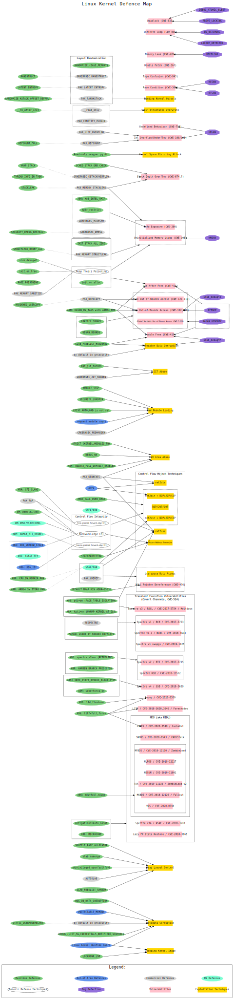

.. Rachel's E-book documentation master file, created by
   sphinx-quickstart on Sun Jan  9 16:38:00 2022.
   You can adapt this file completely to your liking, but it should at least
   contain the root `toctree` directive.

linux 内核安全架构分析
---------------------

- 内核文档：https://www.kernel.org/doc/html/latest/security/index.html

- 以linux-kernel-defence-map为蓝本进行整理。(引用自：https://github.com/a13xp0p0v/linux-kernel-defence-map.git）

.. toctree::
   :maxdepth: 2
   
   cred
   ima
   key
   lsm
   ask
   sctp
   ksp
   tpm
   dsv
   

