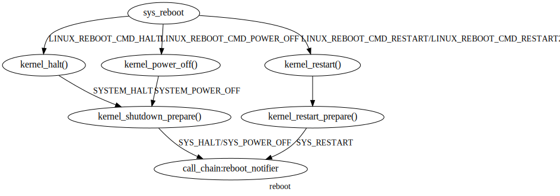

linux 内核通知链: notifier
--------------------------
应用场景描述
^^^^^^^^^^
管理通知链的例程，用于将状态更改传递给任何感兴趣的例程。 对某个状态感兴趣的例程则可以将自己的状态处理hook注册到对应通知链上。

通知链分类
^^^^^^^^^
- 原子通知链：在中断/原子上下文中运行回调。回调例程中不允许阻塞。
- 可阻塞通知链：运行在进程上下文，回调例程中允许阻塞。
- 原始通知链：对回调例程的调用、注册、注销没有限制，由调用者提供加锁和保护。
- SRCU通知链：阻塞通知链的一种变体，具有相同的限制。

可以从原子上下文调用atomic_notifier_chain_register()，但只能从进程上下文调用blocking_notifier_chain_register()和srcu_notifier_chain_register()，这个规则同样适用于对应的注销函数。
不能在通知链中调用atomic_notifier_chain_unregister(), blocking_notifier_chain_unregister()和srcu_notifier_chain_unregister()函数。

SRCU通知链是阻塞通知链的变体。用SRCU（Sleepable Read-Copy Update）代替rw信号量作为链的保护方式。srcu_notifier_call_chain()有很低的开销：no cache bounces and no memory barriers.当链会被非常频繁地调用但 notifier_blocks 很少被删除时，应该使用 SRCU 通知链。

结构
^^^^^
.. code-block:: c
	:caption: notifier相关结构
	:emphasize-lines: 4,5
	:linenos:
	
	struct notifier_block;

	typedef	int (*notifier_fn_t)(struct notifier_block *nb,
			unsigned long action, void *data);

	struct notifier_block {
		notifier_fn_t notifier_call;
		struct notifier_block __rcu *next;
		int priority;
	};

	struct atomic_notifier_head {
		spinlock_t lock;
		struct notifier_block __rcu *head;
	};

	struct blocking_notifier_head {
		struct rw_semaphore rwsem;
		struct notifier_block __rcu *head;
	};

	struct raw_notifier_head {
		struct notifier_block __rcu *head;
	};

	struct srcu_notifier_head {
		struct mutex mutex;
		struct srcu_struct srcu;
		struct notifier_block __rcu *head;
	};

通知链声明：

.. code-block:: c
	:caption: 通知链初始化
	:emphasize-lines: 4,5
	:linenos:
	
	#define ATOMIC_NOTIFIER_HEAD(name)	。。。。。。			
	#define BLOCKING_NOTIFIER_HEAD(name)	。。。。。。			
	#define RAW_NOTIFIER_HEAD(name)		。。。。。。			
	#define SRCU_NOTIFIER_HEAD(name)	。。。。。。			
	#define SRCU_NOTIFIER_HEAD_STATIC(name)		。。。。。。

导出符号
^^^^^^^^^

.. code-block:: c
	:caption: 导出函数
	:emphasize-lines: 4,5
	:linenos:
	
	EXPORT_SYMBOL_GPL(atomic_notifier_chain_register);
	EXPORT_SYMBOL_GPL(atomic_notifier_chain_unregister);
	EXPORT_SYMBOL_GPL(atomic_notifier_call_chain_robust);
	EXPORT_SYMBOL_GPL(atomic_notifier_call_chain);
	EXPORT_SYMBOL_GPL(blocking_notifier_chain_register);
	EXPORT_SYMBOL_GPL(blocking_notifier_chain_unregister);
	EXPORT_SYMBOL_GPL(blocking_notifier_call_chain_robust);
	EXPORT_SYMBOL_GPL(blocking_notifier_call_chain);
	EXPORT_SYMBOL_GPL(raw_notifier_chain_register);
	EXPORT_SYMBOL_GPL(raw_notifier_chain_unregister);
	EXPORT_SYMBOL_GPL(raw_notifier_call_chain_robust);
	EXPORT_SYMBOL_GPL(raw_notifier_call_chain);
	EXPORT_SYMBOL_GPL(srcu_notifier_chain_register);
	EXPORT_SYMBOL_GPL(srcu_notifier_chain_unregister);
	EXPORT_SYMBOL_GPL(srcu_notifier_call_chain);
	EXPORT_SYMBOL_GPL(srcu_init_notifier_head);
	EXPORT_SYMBOL_GPL(register_die_notifier);
	EXPORT_SYMBOL_GPL(unregister_die_notifier);

常用通知链总结
^^^^^^^^^^^^^^
到目前为止已声明的通知程序。 可以想象随着时间的推移会有更多的链（例如笔记本电脑电源重置链、重启链（清理设备单元）、设备 [un]mount 链、模块加载/卸载链、内存不足链、screenblank 链（用于插入 模块化screenblankers）VC开关链（用于可加载内核svgalib VC开关助手）等......

- CPU 通知器在 include/linux/cpu.h 中定义。
- netdevice 通知器在 include/linux/netdevice.h 中定义 
- 重启通知在 include/linux/reboot.h 中定义。 
- 休眠和挂起事件在 include/linux/suspend.h 中定义。
- 虚拟终端事件在 include/linux/vt.h 中定义。
- arch/x86/kernel/cpu/mce/core.c:BLOCKING_NOTIFIER_HEAD(x86_mce_decoder_chain);
- arch/x86/kernel/cpu/mce/dev-mcelog.c:BLOCKING_NOTIFIER_HEAD(mce_injector_chain);
- arch/x86/platform/intel/iosf_mbi.c:BLOCKING_NOTIFIER_HEAD(iosf_mbi_pmic_bus_access_notifier);
- kernel/notifier.c:15:BLOCKING_NOTIFIER_HEAD(reboot_notifier_list);
- kernel/notifier.c:533:static ATOMIC_NOTIFIER_HEAD(die_chain);
- kernel/panic.c:70:ATOMIC_NOTIFIER_HEAD(panic_notifier_list);
- kernel/power/main.c:69:static BLOCKING_NOTIFIER_HEAD(pm_chain_head);
- kernel/power/qos.c:444:        BLOCKING_INIT_NOTIFIER_HEAD(c->notifiers);
- kernel/power/qos.c:453:        BLOCKING_INIT_NOTIFIER_HEAD(c->notifiers);
- kernel/profile.c:138:static BLOCKING_NOTIFIER_HEAD(task_exit_notifier);
- kernel/profile.c:139:static ATOMIC_NOTIFIER_HEAD(task_free_notifier);
- kernel/profile.c:140:static BLOCKING_NOTIFIER_HEAD(munmap_notifier);
- kernel/reboot.c:142:static ATOMIC_NOTIFIER_HEAD(restart_handler_list);
- kernel/time/timekeeping.c:649:static RAW_NOTIFIER_HEAD(pvclock_gtod_chain);
- kernel/tracepoint.c:577:static BLOCKING_NOTIFIER_HEAD(tracepoint_notify_list);
- mm/oom_kill.c:1025:static BLOCKING_NOTIFIER_HEAD(oom_notify_list);
- mm/vmalloc.c:780:static BLOCKING_NOTIFIER_HEAD(vmap_notify_list);
- crypto/api.c:30:BLOCKING_NOTIFIER_HEAD(crypto_chain);
- crypto/fips.c:19:ATOMIC_NOTIFIER_HEAD(fips_fail_notif_chain);
- security/security.c:74:static BLOCKING_NOTIFIER_HEAD(blocking_lsm_notifier_chain);

reboot通知链接总结
^^^^^^^^^^^^^^^^^^

