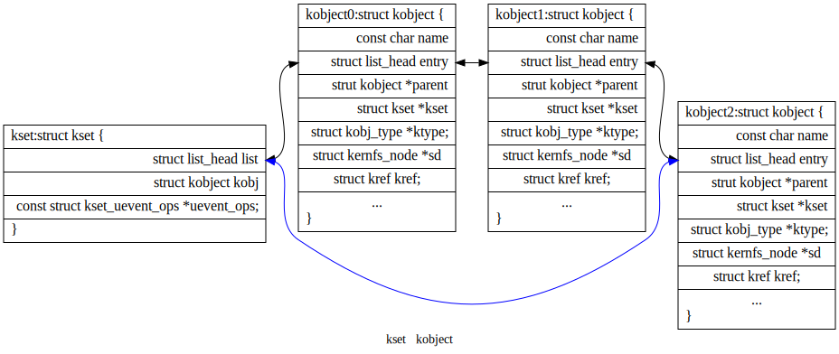
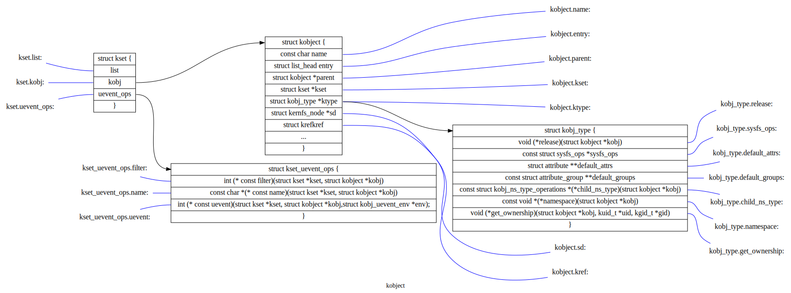
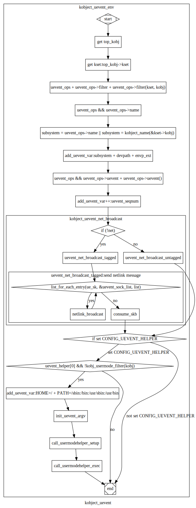

kobject理解
-----------
内核对象的嵌入单元,主要应用在内核与用户空间信息的交互：

- 每个kobject对应一个sysfs目录，可用于导出对象信息；

- 以kset为单位提供uevent结构，实现异步通知。帮助实现kobject热插拔；

- kset与kobject实现内核对象的分类组织。进一步将内核信息有组织地通过sysfs文件系统向用户空间进行呈现。

- kset与子系统（subsystem)对应；

对kset、kobject的理解
^^^^^^^^^^^^^^^^
kset与kobject结构间的关系：

kobject 结构关系图
^^^^^^^^^^^^^^^^^
每个kobject对应一个sysfs目录（kset借助内嵌的kobject成员对应一个sysfs目录)

uevent总结
^^^^^^^^^^
一个kset通过内嵌的kset_uevent_ops结构来对与其相关的kobject的状态变化进行进一步处理。

.. code-block:: c
	:caption: struct kset_uevent_ops
	:emphasize-lines: 4,5
	:linenos:
	struct kset_uevent_ops {
  	      int (* const filter)(struct kobject *kobj);
  	      const char *(* const name)(struct kobject *kobj);
   	     int (* const uevent)(struct kobject *kobj, struct kobj_uevent_env *env);
	};

- filter函数允许kset阻止一个特定kobject的uevent被发送到用户空间。 如果该函数返回0，该uevent将不会被发送出去。
- name函数将被调用用于覆盖uevent发送到用户空间的kset的默认名称。默认情况下，该名称将与kset本身相同。
- 当事件被发送至用户空间前，调用uevent函数来设置更多的环境变量。

相关状态：

.. code-block:: c
	:caption: enum kobject_action
	:emphasize-lines: 4,5
	:linenos:

	/* counter to tag the uevent, read only except for the kobject core */
	extern u64 uevent_seqnum;

	/*
	* The actions here must match the index to the string array
 	* in lib/kobject_uevent.c
 	*
 	* Do not add new actions here without checking with the driver-core
 	* maintainers. Action strings are not meant to express subsystem
 	* or device specific properties. In most cases you want to send a
 	* kobject_uevent_env(kobj, KOBJ_CHANGE, env) with additional event
 	* specific variables added to the event environment.
 	*/
	enum kobject_action {
		KOBJ_ADD,
		KOBJ_REMOVE,
		KOBJ_CHANGE,
		KOBJ_MOVE,
		KOBJ_ONLINE,
		KOBJ_OFFLINE,
		KOBJ_BIND,
		KOBJ_UNBIND,
	};

通过调用kobject_uevent进行事件通知

.. code-block:: c
	:caption: kobject_uevent
	:emphasize-lines: 4,5
	:linenos:
	/**
 	* kobject_uevent - notify userspace by sending an uevent
 	*
 	* @kobj: struct kobject that the action is happening to
 	* @action: action that is happening
 	*
 	* Returns 0 if kobject_uevent() is completed with success or the
 	* corresponding error when it fails.
 	*/
	int kobject_uevent(struct kobject *kobj, enum kobject_action action)
	{
		return kobject_uevent_env(kobj, action, NULL);
	}

事件发送处理流程：

kobject_uevent函数流程图显示了其功能实现的底层逻辑。

kobject API总结
^^^^^^^^^^^^^^^^^^^^

一个kset有以下功能:它像是一个包含一组对象(struct kobject)的袋子。一个kset可以被内核用来追踪“所有块设备”或“所有PCI设备驱动”,也可用于追踪某类内核时间状态变化。kset也是sysfs中的一个子目录，代表kset本身的kobject结构与对应的sysfs目录对应，kset对应的kobject它可以被设置为其他kobject的父对象，进而与kset包含的kobject形成一个数结构；sysfs层次结构的顶级目录就是以这种方式构建的。

Ksets通过uevent_ops成员实现kobjects的“热插拔”，将"热插拔"事件传递给用户空间，应用程序进行进一步的处理。

kset在一个标准的内核链表(list)中保存它的子对象(kobject)。Kobjects中的kset字段指向包含自身的kset。在几乎所有的情况下，属于一个kset的kobjects的父对象成员都指向kset内嵌的kobject。

由于kset中包含一个kobject，它应该总是被动态地创建，而不是静态地 或在堆栈中声明。要创建一个新的kset，请使用:

struct kset *kset_create_and_add(const char *name,
                                 const struct kset_uevent_ops *uevent_ops,
                                 struct kobject *parent_kobj);
                                 
                                 
当你完成对kset的处理后，调用:

void kset_unregister(struct kset *k);

来销毁它。这将从sysfs中删除该kset并递减其引用计数值。当引用计数 为零时,该kset将被释放。因为对该kset的其他引用可能仍然存在， 释放可能发生在kset_unregister()返回之后。

一个使用kset的例子可以在内核树中的 samples/kobject/kset-example.c 文件中看到。

kobject加入kset
""""""""""""""
有人可能会问，鉴于没有提出执行该功能的函数，究竟如何将一个kobject添加到一个kset中。答案是这个任务是由kobject_add()处理的。当一个 kobject被传递给kobject_add()时，它的kset成员应该指向这个kobject 所属的kset。 kobject_add()将处理剩下的部分。

如果属于一个kset的kobject没有父kobject集，它将被添加到kset的目录中。并非所有的kset成员都必须住在kset目录中。如果在添加kobject 之前分配了一个明确的父kobject，那么该kobject将被注册到kset中， 但是被添加到父kobject下面。
                               

kobject 操作
""""""""""""

通过kobject_add()注册了你的kobject，不要使用kfree()来直接释放它。用kobject_put()来释放。在kobject_init()后，通过调用kobject_put()来进行正确释放。具体操作通过调用kobject的release()方法完成的。release()存储在kobject内嵌的结构体kobj_type中；实际编程中通过调用内核库中封装的kobject函数对kobject等进行操作，不要采用自己定义接口进行处理。

具体API参考内核文档：https://www.kernel.org/doc/html/latest/core-api/kobject.html

内嵌kobject的内核结构
^^^^^^^^^^^^^^^^^^^
主要应用于设备驱动结构中，对设备驱动进行分类，并以sysfs中目录结构形式进行呈现。

内核示例程序
^^^^^^^^^^
samples/kobject/{kobject-example.c,kset-example.c}

引用参考
^^^^^^^
https://www.kernel.org/doc/html/latest/core-api/kobject.html

