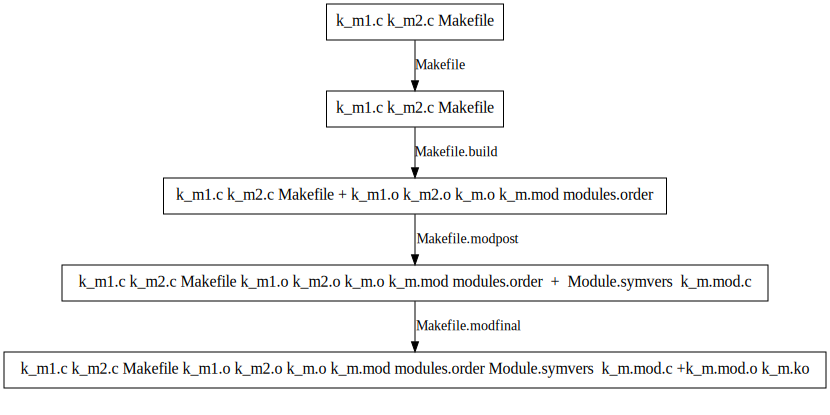
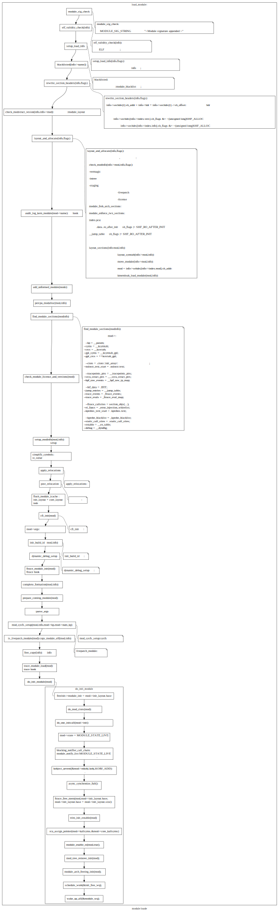

linux 内核模块原理分析
^^^^^^^^^^^^^^^^^^^^
linux 内核模块编程基础
"""""""""""""""""""
- 每个模块由一个struct module表示

.. code-block:: c
	:caption: struct module
	:emphasize-lines: 4,5
	:linenos:
	
	struct module {
		enum module_state state;//记录模块状态，如正常，加载，卸载等：	MODULE_STATE_LIVE/MODULE_STATE_COMING/MODULE_STATE_GOING/MODULE_STATE_UNFORMED

		/* Member of list of modules */
		struct list_head list; /* 系统中的模块通过这个成员组织成一个双向链表 */

		/* Unique handle for this module */
		char name[MODULE_NAME_LEN];/* 模块名,系统中模块名标注模块的唯一性 */

	#ifdef CONFIG_STACKTRACE_BUILD_ID
		/* Module build ID */
		unsigned char build_id[BUILD_ID_SIZE_MAX];/* build id:场景描述： */
	#endif

		/* Sysfs stuff. */
		struct module_kobject mkobj;/* 代表模块的kobject 结构*/
		struct module_attribute *modinfo_attrs;
		const char *version;
		const char *srcversion;
		struct kobject *holders_dir; 

		/* Exported symbols */
		const struct kernel_symbol *syms;/* 导出符号表:对应节 __ksymtab */
		const s32 *crcs; /* 符号地址表:对应节 __kcrctab */
		unsigned int num_syms;/* 导出符号个数  */

	#ifdef CONFIG_CFI_CLANG
		cfi_check_fn cfi_check;
	#endif

		/* Kernel parameters. */
	#ifdef CONFIG_SYSFS
		struct mutex param_lock;
	#endif
		struct kernel_param *kp;/* 内核模块参数表:对应节 __param */
		unsigned int num_kp;  /* 内核模块参数个数 */

		/* GPL-only exported symbols. */
		unsigned int num_gpl_syms; /* 导出遵循GPL许可的符号个数 */
		const struct kernel_symbol *gpl_syms; /* 遵循GPL许可的导出符号表:对应节 __ksymtab_gpl */
		const s32 *gpl_crcs; /* 符号地址:对应节 __kcrctab_gpl */
		bool using_gplonly_symbols;/* 引用了GPL许可的符号 */

	#ifdef CONFIG_MODULE_SIG
		/* Signature was verified. */
		bool sig_ok;
	#endif

		bool async_probe_requested;

		/* Exception table */
		unsigned int num_exentries; /* 异常表数目 */
		struct exception_table_entry *extable;/* 异常表 */

		/* Startup function. */
		int (*init)(void);//初始化句柄

		/* Core layout: rbtree is accessed frequently, so keep together. */
		struct module_layout core_layout __module_layout_align; /* 常驻内存的内存布局 */
		struct module_layout init_layout; /* 初始化函数执行完后，需要释放  */

		/* Arch-specific module values */
		struct mod_arch_specific arch;

		unsigned long taints;	/* same bits as kernel:taint_flags */

	#ifdef CONFIG_GENERIC_BUG
		/* Support for BUG */
		unsigned num_bugs;
		struct list_head bug_list;
		struct bug_entry *bug_table;
	#endif

	#ifdef CONFIG_KALLSYMS
		/* Protected by RCU and/or module_mutex: use rcu_dereference() */
		struct mod_kallsyms __rcu *kallsyms;
		struct mod_kallsyms core_kallsyms;

		/* Section attributes */
		struct module_sect_attrs *sect_attrs;

		/* Notes attributes */
		struct module_notes_attrs *notes_attrs;
	#endif

		/* The command line arguments (may be mangled).  People like
		   keeping pointers to this stuff */
		char *args;

	#ifdef CONFIG_SMP
		/* Per-cpu data. */
		void __percpu *percpu;
		unsigned int percpu_size;
	#endif
		void *noinstr_text_start;
		unsigned int noinstr_text_size;

	#ifdef CONFIG_TRACEPOINTS
		unsigned int num_tracepoints;
		tracepoint_ptr_t *tracepoints_ptrs;
	#endif
	#ifdef CONFIG_TREE_SRCU
		unsigned int num_srcu_structs;
		struct srcu_struct **srcu_struct_ptrs;
	#endif
	#ifdef CONFIG_BPF_EVENTS
		unsigned int num_bpf_raw_events;
		struct bpf_raw_event_map *bpf_raw_events;
	#endif
	#ifdef CONFIG_DEBUG_INFO_BTF_MODULES
		unsigned int btf_data_size;
		void *btf_data;
	#endif
	#ifdef CONFIG_JUMP_LABEL
		struct jump_entry *jump_entries;
		unsigned int num_jump_entries;
	#endif
	#ifdef CONFIG_TRACING
		unsigned int num_trace_bprintk_fmt;
		const char **trace_bprintk_fmt_start;
	#endif
	#ifdef CONFIG_EVENT_TRACING
		struct trace_event_call **trace_events;
		unsigned int num_trace_events;
		struct trace_eval_map **trace_evals;
		unsigned int num_trace_evals;
	#endif
	#ifdef CONFIG_FTRACE_MCOUNT_RECORD
		unsigned int num_ftrace_callsites;
		unsigned long *ftrace_callsites;
	#endif
	#ifdef CONFIG_KPROBES
		void *kprobes_text_start;
		unsigned int kprobes_text_size;
		unsigned long *kprobe_blacklist;
		unsigned int num_kprobe_blacklist;
	#endif
	#ifdef CONFIG_HAVE_STATIC_CALL_INLINE
		int num_static_call_sites;
		struct static_call_site *static_call_sites;
	#endif

	#ifdef CONFIG_LIVEPATCH
		bool klp; /* Is this a livepatch module? */
		bool klp_alive;

		/* Elf information */
		struct klp_modinfo *klp_info;
	#endif

	#ifdef CONFIG_MODULE_UNLOAD
		/* What modules depend on me? */
		struct list_head source_list;/* 依赖的模块列表 */
		/* What modules do I depend on? */
		struct list_head target_list; /* 依赖我的内核模块列表 */

		/* Destruction function. */
		void (*exit)(void);

		atomic_t refcnt;
	#endif

	#ifdef CONFIG_CONSTRUCTORS
		/* Constructor functions. */
		ctor_fn_t *ctors;
		unsigned int num_ctors;
	#endif

	#ifdef CONFIG_FUNCTION_ERROR_INJECTION
		struct error_injection_entry *ei_funcs;
		unsigned int num_ei_funcs;
	#endif
	} ____cacheline_aligned __randomize_layout;

- demo.c:

.. code-block:: c
	:caption: 内核模块demo.c
	:emphasize-lines: 4,5
	:linenos:
	
	#include <linux/kernel.h>
	#include <linux/module.h>
	static int __init k_mod_sample_init(void)
	{
		pr_info("%s:%d\n",__func__,__LINE__);
		return 0;
	}

	static void __exit k_mod_sample_exit(void)
	{
		pr_info("%s:%d\n",__func__,__LINE__);
	}

	module_init(k_mod_sample_init)
	module_exit(k_mod_sample_exit)
	MODULE_LICENSE("GPL");

demo.mod.c

.. code-block:: c
	:caption: 中间文件demo.mod.c
	:emphasize-lines: 4,5
	:linenos:
	

	#include <linux/module.h>
	#define INCLUDE_VERMAGIC
	#include <linux/build-salt.h>
	#include <linux/elfnote-lto.h>
	#include <linux/vermagic.h>
	#include <linux/compiler.h>

	BUILD_SALT;
	BUILD_LTO_INFO;

	MODULE_INFO(vermagic, VERMAGIC_STRING);
	MODULE_INFO(name, KBUILD_MODNAME);

	__visible struct module __this_module
	__section(".gnu.linkonce.this_module") = {
		.name = KBUILD_MODNAME,
		.init = init_module,
	#ifdef CONFIG_MODULE_UNLOAD
		.exit = cleanup_module,
	#endif
		.arch = MODULE_ARCH_INIT,
	};

	#ifdef CONFIG_RETPOLINE
	MODULE_INFO(retpoline, "Y");
	#endif

	static const struct modversion_info ____versions[]
	__used __section("__versions") = {
		{ 0x9736759a, "module_layout" },
		{ 0xc5850110, "printk" },
		{ 0xbdfb6dbb, "__fentry__" },
	};

	MODULE_INFO(depends, "");

- 模块组织：

.. code-block:: c
	:caption: 注册到系统中的模块索引
	:emphasize-lines: 4,5
	:linenos:
	
	/*
	 * Mutex protects:
	 * 1) List of modules (also safely readable with preempt_disable),
	 * 2) module_use links,
	 * 3) module_addr_min/module_addr_max.
	 * (delete and add uses RCU list operations).
	 */
 
	static DEFINE_MUTEX(module_mutex);
	static LIST_HEAD(modules);//注册到系统中所有的模块列表

内核编译及调试参考：
""""""""""""""""""

.. raw:: html

	<iframe src="../lk_devel/lk_build/m_build.html" height="345px" width="100%"></iframe>
	
内核模块编译流程原理分析
""""""""""""""""""""
对模块的编译过程进行分析，总结。

构建过程分析
***********
- make流程分析

A.make:$(MAKE) -C $(KDIR) M=$(PWD) modules

.. code-block:: c
	:caption: make命令解析
	:emphasize-lines: 4,5
	:linenos:
  
	   1. cd $(KDIR)
	   2. $M = $(PWD)
	   3. make modules
	   
B. kernel/Makefile 内核模块编译说明。
  
   1. KBUILD_EXTMOD := $(M) : make M=dir (外部模块目录)
   2. KBUILD_MODULES := 1
   3. build-dirs := $(KBUILD_EXTMOD)
   4. Makefile: modules:$(MODORDER) 等价于: modules: /root/for_work/rootkit/demo1/k_mod
      
      .. code-block:: c
	:caption: 代码片段
	:emphasize-lines: 4,5
	:linenos:
      
      		# External module support.
      		# When building external modules the kernel used as basis is considered
      		# read-only, and no consistency checks are made and the make
      		# system is not used on the basis kernel. If updates are required
      		# in the basis kernel ordinary make commands (without M=...) must
      		# be used.
      		#
      		# The following are the only valid targets when building external
      		# modules.
      		# make M=dir clean     Delete all automatically generated files
      		# make M=dir modules   Make all modules in specified dir
      		# make M=dir	       Same as 'make M=dir modules'
      		# make M=dir modules_install
      		#                      Install the modules built in the module directory
      		#                      Assumes install directory is already created
      
      		# We are always building only modules.
      		KBUILD_BUILTIN :=
      		KBUILD_MODULES := 1
      
      		build-dirs := $(KBUILD_EXTMOD)
      		PHONY += modules
      		modules: $(MODORDER)
      			$(Q)$(MAKE) -f $(srctree)/scripts/Makefile.modpost
      
      		$(MODORDER): descend
      			@:
      	
      		descend: $(build-dirs)
      		$(build-dirs): prepare      #此处prepare为空
      			$(Q)$(MAKE) $(build)=$@ \
      			single-build=$(if $(filter-out $@/, $(filter $@/%, $(KBUILD_SINGLE_TARGETS))),1) \
      			need-builtin=1 need-modorder=1
    
      Makefile中modules的前提条件:$(MODORDER)，以上指令等价于： 
      
      .. code-block:: c
      	:caption: 代码片段

	:linenos:
         
         /root/for_work/rootkit/demo1/k_mod: make -f ./scripts/Makefile.build obj=/root/for_work/rootkit/demo1/k_mod  single-build=  need-builtin=1 need-modorder=1
         
   5. Makefile.build相关片段:
      
      .. code-block:: c
	:caption: 代码片段
	:emphasize-lines: 4,5
	:linenos:
	
      		__build: $(if $(KBUILD_BUILTIN), $(targets-for-builtin)) \
      			 $(if $(KBUILD_MODULES), $(targets-for-modules)) \
      			 $(subdir-ym) $(always-y)
      			@echo "target:" $(if $(KBUILD_BUILTIN), $(targets-for-builtin)) \  #(额外添加)
      	 		$(if $(KBUILD_MODULES), $(targets-for-modules)) \
      			 $(subdir-ym) $(always-y)
      			@:
   
      结果:#make 
      
      .. code-block:: c
	:caption: 代码片段
	:emphasize-lines: 4,5
	:linenos:
      
      		step "target:" /path/k_mod/k_m.mod /root/for_work/rootkit/demo1/k_mod/modules.order
  
  
       也就是说可以将目标理解为:
      
      .. code-block:: c
	:caption: 代码片段
	:emphasize-lines: 4,5
	:linenos:
		__build:/path/k_mod/k_m.mod /root/for_work/rootkit/demo1/k_mod/modules.order
               
               	k_m.mod:
               
                   	cmd_mod = { \
                    		echo $(if $($*-objs)$($*-y)$($*-m), $(addprefix $(obj)/, $($*-objs) $($*-y) $($*-m)), $(@:.mod=.o)); \
                    		$(undefined_syms) echo; \
                    		} > $@
                    
                   	 $(obj)/%.mod: $(obj)/%.o FORCE 
                    		$(call if_changed,mod)

      等价于:
      
      
      .. code-block:: c
	:caption: 代码片段
	:emphasize-lines: 4,5
	:linenos:
	
		/path/k_mod/k_m.mod: /path/k_mod/k_m.o FORCE

      通过/path/k_mod/Makefile我们知道k_m.o依赖:
      
      .. code-block:: c
	:caption: 代码片段
	:emphasize-lines: 4,5
	:linenos:
	
	obj-m := k_m.o
      	k_m-m := k_m1.o k_m2.o

      而Makefile.build中对*.o定义为:编译目标文件:*.c --> *.o：
      
      .. code-block:: c
	:caption: 代码片段
	:emphasize-lines: 4,5
	:linenos:
	
      	# Built-in and composite module parts
      	$(obj)/%.o: $(src)/%.c $(recordmcount_source) $(objtool_dep) FORCE
      		$(call if_changed_rule,cc_o_c)
      		@echo $(rule_cc_o_c)	#额外添加,具体信息在下一条说明
      		$(call cmd,force_checksrc)

      其规则展开为:
      
      .. code-block:: c
	:caption: 代码片段
	:emphasize-lines: 4,5
	:linenos:
	
	echo    @set -e;  echo '  CC [M]  /root/for_work/rootkit/demo1/k_mod/k_m1.o'; gcc -Wp,-MMD,/root/for_work/rootkit/demo1/k_mod/.k_m1.o.d -nostdinc -isystem /usr/lib/gcc/x86_64-linux-gnu/10/include -I./arch/x86/include -I./arch/x86/include/generated  -I./include -I./arch/x86/include/uapi -I./arch/x86/include/generated/uapi -I./include/uapi -I./include/generated/uapi -include ./include/linux/kconfig.h -include ./include/linux/compiler_types.h -D__KERNEL__ -fmacro-prefix-map=./= -Wall -Wundef -Werror=strict-prototypes -Wno-trigraphs -fno-strict-aliasing -fno-common -fshort-wchar -fno-PIE -Werror=implicit-function-declaration -Werror=implicit-int -Werror=return-type -Wno-format-security -std=gnu89 -mno-sse -mno-mmx -mno-sse2 -mno-3dnow -mno-avx -m64 -falign-jumps=1 -falign-loops=1 -mno-80387 -mno-fp-ret-in-387 -mpreferred-stack-boundary=3 -mskip-rax-setup -mtune=generic -mno-red-zone -mcmodel=kernel -DCONFIG_X86_X32_ABI -Wno-sign-compare -fno-asynchronous-unwind-tables -mindirect-branch=thunk-extern -mindirect-branch-register -fno-jump-tables -fno-delete-null-pointer-checks -Wno-frame-address -Wno-format-truncation -Wno-format-overflow -Wno-address-of-packed-member -O2 -fno-allow-store-data-races -Wframe-larger-than=2048 -fstack-protector-strong -Wno-unused-but-set-variable -Wimplicit-fallthrough -Wno-unused-const-variable -g -pg -mrecord-mcount -mfentry -DCC_USING_FENTRY -Wdeclaration-after-statement -Wvla -Wno-pointer-sign -Wno-stringop-truncation -Wno-zero-length-bounds -Wno-array-bounds -Wno-stringop-overflow -Wno-restrict -Wno-maybe-uninitialized -fno-strict-overflow -fno-stack-check -fconserve-stack -Werror=date-time -Werror=incompatible-pointer-types -Werror=designated-init -fcf-protection=none -Wno-packed-not-aligned  -DMODULE  -DKBUILD_BASENAME='"k_m1"' -DKBUILD_MODNAME='"k_m"' -c -o /root/for_work/rootkit/demo1/k_mod/k_m1.o /root/for_work/rootkit/demo1/k_mod/k_m1.c; scripts/basic/fixdep /root/for_work/rootkit/demo1/k_mod/.k_m1.o.d /root/for_work/rootkit/demo1/k_mod/k_m1.o 'gcc -Wp,-MMD,/root/for_work/rootkit/demo1/k_mod/.k_m1.o.d -nostdinc -isystem /usr/lib/gcc/x86_64-linux-gnu/10/include -I./arch/x86/include -I./arch/x86/include/generated  -I./include -I./arch/x86/include/uapi -I./arch/x86/include/generated/uapi -I./include/uapi -I./include/generated/uapi -include ./include/linux/kconfig.h -include ./include/linux/compiler_types.h -D__KERNEL__ -fmacro-prefix-map=./= -Wall -Wundef -Werror=strict-prototypes -Wno-trigraphs -fno-strict-aliasing -fno-common -fshort-wchar -fno-PIE -Werror=implicit-function-declaration -Werror=implicit-int -Werror=return-type -Wno-format-security -std=gnu89 -mno-sse -mno-mmx -mno-sse2 -mno-3dnow -mno-avx -m64 -falign-jumps=1 -falign-loops=1 -mno-80387 -mno-fp-ret-in-387 -mpreferred-stack-boundary=3 -mskip-rax-setup -mtune=generic -mno-red-zone -mcmodel=kernel -DCONFIG_X86_X32_ABI -Wno-sign-compare -fno-asynchronous-unwind-tables -mindirect-branch=thunk-extern -mindirect-branch-register -fno-jump-tables -fno-delete-null-pointer-checks -Wno-frame-address -Wno-format-truncation -Wno-format-overflow -Wno-address-of-packed-member -O2 -fno-allow-store-data-races -Wframe-larger-than=2048 -fstack-protector-strong -Wno-unused-but-set-variable -Wimplicit-fallthrough -Wno-unused-const-variable -g -pg -mrecord-mcount -mfentry -DCC_USING_FENTRY -Wdeclaration-after-statement -Wvla -Wno-pointer-sign -Wno-stringop-truncation -Wno-zero-length-bounds -Wno-array-bounds -Wno-stringop-overflow -Wno-restrict -Wno-maybe-uninitialized -fno-strict-overflow -fno-stack-check -fconserve-stack -Werror=date-time -Werror=incompatible-pointer-types -Werror=designated-init -fcf-protection=none -Wno-packed-not-aligned  -DMODULE  -DKBUILD_BASENAME='\''"k_m1"'\'' -DKBUILD_MODNAME='\''"k_m"'\'' -c -o /root/for_work/rootkit/demo1/k_mod/k_m1.o /root/for_work/rootkit/demo1/k_mod/k_m1.c' > /root/for_work/rootkit/demo1/k_mod/.k_m1.o.cmd; rm -f /root/for_work/rootkit/demo1/k_mod/.k_m1.o.d
                    @set -e
          CC [M]  /root/for_work/rootkit/demo1/k_mod/k_m1.o

      注意其中的中间文件:.k_m1.o.d  .k_m1.o.cmd k_m1.o,其force_checksrc展开为(此处没有使能):
      
      .. code-block:: c
	:caption: 代码片段
	:emphasize-lines: 4,5
	:linenos:
	
		sparse -D__linux__ -Dlinux -D__STDC__ -Dunix -D__unix__ -Wbitwise -Wno-return-void -Wno-unknown-attribute -D__x86_64__ --arch=x86 -mlittle-endian -m64 -Wp,-MMD,/root/for_work/rootkit/demo1/k_mod/.k_m2.o.d -nostdinc -isystem /usr/lib/gcc/x86_64-linux-gnu/10/include -I./arch/x86/include -I./arch/x86/include/generated -I./include -I./arch/x86/include/uapi -I./arch/x86/include/generated/uapi -I./include/uapi -I./include/generated/uapi -include ./include/linux/kconfig.h -include ./include/linux/compiler_types.h -D__KERNEL__ -fmacro-prefix-map=./= -Wall -Wundef -Werror=strict-prototypes -Wno-trigraphs -fno-strict-aliasing -fno-common -fshort-wchar -fno-PIE -Werror=implicit-function-declaration -Werror=implicit-int -Werror=return-type -Wno-format-security -std=gnu89 -mno-sse -mno-mmx -mno-sse2 -mno-3dnow -mno-avx -m64 -falign-jumps=1 -falign-loops=1 -mno-80387 -mno-fp-ret-in-387 -mpreferred-stack-boundary=3 -mskip-rax-setup -mtune=generic -mno-red-zone -mcmodel=kernel -DCONFIG_X86_X32_ABI -Wno-sign-compare -fno-asynchronous-unwind-tables -mindirect-branch=thunk-extern -mindirect-branch-register -fno-jump-tables -fno-delete-null-pointer-checks -Wno-frame-address -Wno-format-truncation -Wno-format-overflow -Wno-address-of-packed-member -O2 -fno-allow-store-data-races -Wframe-larger-than=2048 -fstack-protector-strong -Wno-unused-but-set-variable -Wimplicit-fallthrough -Wno-unused-const-variable -g -pg -mrecord-mcount -mfentry -DCC_USING_FENTRY -Wdeclaration-after-statement -Wvla -Wno-pointer-sign -Wno-stringop-truncation -Wno-zero-length-bounds -Wno-array-bounds -Wno-stringop-overflow -Wno-restrict -Wno-maybe-uninitialized -fno-strict-overflow -fno-stack-check -fconserve-stack -Werror=date-time -Werror=incompatible-pointer-types -Werror=designated-init -fcf-protection=none -Wno-packed-not-aligned -DMODULE -DKBUILD_BASENAME="k_m2" -DKBUILD_MODNAME="k_m" /root/for_work/rootkit/demo1/k_mod/k_m2.c force

      k_m1.o k_m2.o链接为k_m.o,根据k_m.o 产生k_m.mod  modules.order:依赖 k_m.o
      
      .. code-block:: c
	:caption: 代码片段
	:emphasize-lines: 4,5
	:linenos:
	
      	# Rule to create modules.order file
      	#
      	# Create commands to either record .ko file or cat modules.order from
      	# a subdirectory
      	# Add $(obj-m) as the prerequisite to avoid updating the timestamp of
      	# modules.order unless contained modules are updated.
      	cmd_modules_order = { $(foreach m, $(real-prereqs), \
          	$(if $(filter %/modules.order, $m), cat $m, echo $(patsubst %.o,%.ko,$m));) :; } \
               	     | $(AWK) '!x[$$0]++' - > $@
      		$(obj)/modules.order: $(obj-m) FORCE
            		$(call if_changed,modules_order)
 
 
      产生modules.order,至此完成Makefile中modules前提条件$(MODORDER) 的处理.
      Makefile modules 菜单指令:
      
      .. code-block:: c
	:caption: 代码片段
	:emphasize-lines: 4,5
	:linenos:
	
	modules: $(MODORDER)
      		$(Q)$(MAKE) -f $(srctree)/scripts/Makefile.modpost
      
   6. 即接下来看指令 make -f Makefile.modpost
      Makefile.modpost编译外部模块内容
      
      .. code-block:: c
	:caption: 代码片段
	:emphasize-lines: 4,5
	:linenos:
	
	__modpost:
	include include/config/auto.conf
      	include scripts/Kbuild.include
      
      	MODPOST = scripts/mod/modpost								\
      		$(if $(CONFIG_MODVERSIONS),-m)							\
      		$(if $(CONFIG_MODULE_SRCVERSION_ALL),-a)					\
      		$(if $(CONFIG_SECTION_MISMATCH_WARN_ONLY),,-E)					\
      		$(if $(KBUILD_MODPOST_WARN),-w) \
      		-o $@
      	# set src + obj - they may be used in the modules's Makefile
      	obj := $(KBUILD_EXTMOD)
      	src := $(obj)
      
      	# Include the module's Makefile to find KBUILD_EXTRA_SYMBOLS
      	include $(if $(wildcard $(KBUILD_EXTMOD)/Kbuild), \
      	             $(KBUILD_EXTMOD)/Kbuild, $(KBUILD_EXTMOD)/Makefile)
      
      	# modpost option for external modules
      	MODPOST += -e
      
      	input-symdump := Module.symvers $(KBUILD_EXTRA_SYMBOLS)
      	output-symdump := $(KBUILD_EXTMOD)/Module.symvers
      	# modpost options for modules (both in-kernel and external)
      	MODPOST += \
      		$(addprefix -i ,$(wildcard $(input-symdump))) \
      		$(if $(KBUILD_NSDEPS),-d $(MODULES_NSDEPS)) \
      		$(if $(CONFIG_MODULE_ALLOW_MISSING_NAMESPACE_IMPORTS)$(KBUILD_NSDEPS),-N)
      	# 'make -i -k' ignores compile errors, and builds as many modules as possible.
      	ifneq ($(findstring i,$(filter-out --%,$(MAKEFLAGS))),)
      	MODPOST += -n
      	endif
      
      	# Clear VPATH to not search for *.symvers in $(srctree). Check only $(objtree).
      	VPATH :=
      	$(input-symdump):
      		@echo >&2 'WARNING: Symbol version dump "$@" is missing.'
      		@echo >&2 '         Modules may not have dependencies or modversions.'
      
      	# Read out modules.order to pass in modpost.
      	# Otherwise, allmodconfig would fail with "Argument list too long".
      	quiet_cmd_modpost = MODPOST $@
           	 cmd_modpost = sed 's/ko$$/o/' $< | $(MODPOST) -T -
      
     	 $(output-symdump): $(MODORDER) $(input-symdump) FORCE
      		$(call if_changed,modpost)
      
      	targets += $(output-symdump)
      
      	__modpost: $(output-symdump)
      	ifneq ($(KBUILD_MODPOST_NOFINAL),1) 
      		$(Q)$(MAKE) -f $(srctree)/scripts/Makefile.modfinal :这一步通常情况下是要执行的
      	endif 	

      1. 第一步
         1. 创建单独的.o文件(如生成k_m1.o k_m2.o)
         2. 链接需要的.o 文件为\<module\>.o 文件(k_m1.o k_m2.o 链接为k_m.o)
         3. 生成\<module\>.mod文件,列出了初步的.o文件,(如k_m1.o k_m2.o)
         4. modules.order:列出所有的模块(k_m.ko)
      2. 第二步
         1. 查找所有在modules.order中列出的模块
      3. 第三步:修改模块ELF节中的信息,包含以下几个方面:与.mod.c相关
         1. Version magic(include/linux/vermagic.h来获取细节)
            1. Kernel release
            2. SMP is CONFIG_SMP
            3. PREEMPT is CONFIG_PREEMPT[_RT]
            4. GCC Version
         2. Module info
            1. Module version(MODULE_VERSION)
            2. Module alias'es(MODULE_ALIAS)
            3. Module license(MODULE_LICENSE)
            4. 参考include/linux/module.h来获取更多哦细节
      4. 第四步:仅用于允许外部模块中的模块版本控制，其中每个模块的 CRC 从 Module.symvers 文件中检索
      5. Makefile.modpost参数设置:
         KBUILD_MODPOST_WARN:可以设置以避免在最终模块链接阶段出现未定义符号时出错.
         KBUILD_MODPOST_NOFINAL:可以设置用于忽略最后的模块链接.
   
      目前为止,我们完成了第一步,已经产生文件:k_m1.o k_m2.o k_m.o k_m.mod modules.order 现在进入第二步.
      Makefile.modpost关键信息:
   
      
      .. code-block:: c
      	:caption: 代码片段
	:emphasize-lines: 4,5
	:linenos:
      
      	$(output-symdump): $(MODORDER) $(input-symdump) FORCE
      		$(call if_changed,modpost)
      
      	targets += $(output-symdump)
      
      	__modpost: $(output-symdump)
      	ifneq ($(KBUILD_MODPOST_NOFINAL),1) 
      		$(Q)$(MAKE) -f $(srctree)/scripts/Makefile.modfinal :这一步通常情况下是要执行的
      	endif
 
 
      $(output-symdump)定义:
      
      .. code-block:: c
	:caption: 代码片段
	:emphasize-lines: 4,5
	:linenos:
	
      	$(output-symdump): $(MODORDER) $(input-symdump) FORCE
      		$(call if_changed,modpost)

      等价于:
      
      .. code-block:: c
	:caption: 代码片段
	:emphasize-lines: 4,5
	:linenos:
	
      	/path/k_mod/Module.symvers: /path/kmod/modules.order Module.symvers
      		scripts/mod/modpost -m -o /path/k_mod/Module.symvers -e -i Module.symvers -T /path/k_mod/k_m.o
 
      1. Module.symvers:内核代码树文件,已经有了
      2. /path/kmod/modules.order:第一步中已经产生
      3. /path/k_mod/k_m.o: 第一步已经产生
      4. Module.symvers由指令 scripts/mod/modpost -m -o /path/k_mod/Module.symvers -e -i Module.symvers -T /path/k_mod/k_m.o产生.执行过程中产生文件 k_m.mod.c (scripts/mod/modpost.c代码段如下:),并产生 /path/k_mod/Module.symvers文件.
      
      .. code-block:: c
	:caption: scripts/mod/modpost.c中相关代码片段
	:emphasize-lines: 4,5
	:linenos:
	
         		err |= check_modname_len(mod);
         		err |= check_exports(mod);
         
         		add_header(&buf, mod);
         		add_intree_flag(&buf, !external_module);
         		add_retpoline(&buf);
         		add_staging_flag(&buf, mod->name);
         		err |= add_versions(&buf, mod);
         		add_depends(&buf, mod);
         		add_moddevtable(&buf, mod);
         		add_srcversion(&buf, mod);
         
         		sprintf(fname, "%s.mod.c", mod->name);
         		write_if_changed(&buf, fname);
     
   7.  最后一步产生最终的内核模块文件:make -f Makefile.modfinal
      $(MAKE) -f $(srctree)/scripts/Makefile.modfinal,目前已经产生的文件有:k_m1.o k_m2.o k_m.o k_m.mod modules.order   Module.symvers  k_m.mod.c
      
      .. code-block:: c
	:caption: 代码片段
	:emphasize-lines: 4,5
	:linenos:
	
	__modfinal: $(modules)
      		@:

      等价于
      
            
      .. code-block:: c
	:caption: 代码片段
	:emphasize-lines: 4,5
	:linenos:
	
	__modfinal:/path/k_mod/k_m.ko
      		@:
      
      进一步依赖
      
      .. code-block:: c
	:caption: 代码片段
	:emphasize-lines: 4,5
	:linenos:
	
	$(modules): %.ko: %.o %.mod.o $(ARCH_MODULE_LDS) FORCE
      		+$(call if_changed,ld_ko_o)
      
      等价于
      
      .. code-block:: c
	:caption: 代码片段
	:emphasize-lines: 4,5
	:linenos:
	
	k_m.ko: k_m.ko: k_m.o k_m.mod.o scripts/module.lds FORCE
      		ld -r -m elf_x86_64 --build-id=sha1 -T scripts/module.lds -o /root/for_work/rootkit/demo1/k_mod/k_m.ko /root/for_work/rootkit/demo1/k_mod/k_m.o /root/for_work/rootkit/demo1/k_mod/k_m.mod.o
      
      其中k_m.o scripts/module.lds都已经存在,只需要关注k_m.mo.o
            
      .. code-block:: c
	:caption: 代码片段
	:emphasize-lines: 4,5
	:linenos:
	
      	quiet_cmd_cc_o_c = CC [M]  $@
            cmd_cc_o_c = $(CC) $(c_flags) -c -o $@ $<
      
      %.mod.o: %.mod.c FORCE
      	$(call if_changed_dep,cc_o_c)

      等价于
      
      
      .. code-block:: c
	:caption: 代码片段
	:linenos:
	
      	k_m.mod.o: k_m.mod.c FORCE
      		gcc -Wp,-MMD,/root/for_work/rootkit/demo1/k_mod/.k_m.mod.o.d -nostdinc -isystem /usr/lib/gcc/x86_64-linux-gnu/10/include -I./arch/x86/include -I./arch/x86/include/generated -I./include -I./arch/x86/include/uapi -I./arch/x86/include/generated/uapi -I./include/uapi -I./include/generated/uapi -include ./include/linux/kconfig.h -include ./include/linux/compiler_types.h -D__KERNEL__ -fmacro-prefix-map=./= -Wall -Wundef -Werror=strict-prototypes -Wno-trigraphs -fno-strict-aliasing -fno-common -fshort-wchar -fno-PIE -Werror=implicit-function-declaration -Werror=implicit-int -Werror=return-type -Wno-format-security -std=gnu89 -mno-sse -mno-mmx -mno-sse2 -mno-3dnow -mno-avx -m64 -falign-jumps=1 -falign-loops=1 -mno-80387 -mno-fp-ret-in-387 -mpreferred-stack-boundary=3 -mskip-rax-setup -mtune=generic -mno-red-zone -mcmodel=kernel -DCONFIG_X86_X32_ABI -Wno-sign-compare -fno-asynchronous-unwind-tables -mindirect-branch=thunk-extern -mindirect-branch-register -fno-jump-tables -fno-delete-null-pointer-checks -Wno-frame-address -Wno-format-truncation -Wno-format-overflow -Wno-address-of-packed-member -O2 -fno-allow-store-data-races -Wframe-larger-than=2048 -fstack-protector-strong -Wno-unused-but-set-variable -Wimplicit-fallthrough -Wno-unused-const-variable -g -pg -mrecord-mcount -mfentry -DCC_USING_FENTRY -Wdeclaration-after-statement -Wvla -Wno-pointer-sign -Wno-stringop-truncation -Wno-zero-length-bounds -Wno-array-bounds -Wno-stringop-overflow -Wno-restrict -Wno-maybe-uninitialized -fno-strict-overflow -fno-stack-check -fconserve-stack -Werror=date-time -Werror=incompatible-pointer-types -Werror=designated-init -fcf-protection=none -Wno-packed-not-aligned -DMODULE -DKBUILD_BASENAME="k_m.mod" -DKBUILD_MODNAME="k_m" -c -o /root/for_work/rootkit/demo1/k_mod/k_m.mod.o /root/for_work/rootkit/demo1/k_mod/k_m.mod.c

      至此,内核模块编译完成,有效文件包括:k_m1.o k_m2.o k_m.o k_m.mod modules.order   Module.symvers  k_m.mod.c k_m.mod.o k_m.ko
C. 编译流程图

总结
******
对内核模块的编译过程进行流程性说明，下一章针对符号、认证、调试等信息的处理细节进行描述，会对内核模块的二进制格式进行更深入分析。

内核导出符号
""""""""""""""""""""""
模块中引用外部函数
***************
模块中对外部符号的引用分两种：
1.内核中的导出符号：
      
      .. code-block:: c
	:caption: 内核模块可引用内核到处符号
	:linenos:
	 
	 __start___ksymtab, __stop___ksymtab, __start___kcrctab,
	 __start___ksymtab_gpl, __stop___ksymtab_gpl,__start___kcrctab_gpl,
	 
	......
	 __ksymtab : AT(ADDR(__ksymtab) - 0xffffffff80000000) { __start___ksymtab = .; KEEP(*(SORT(___ksymtab+*))) __stop___ksymtab = .; } __ksymtab_gpl : AT(ADDR(__ksymtab_gpl) - 0xffffffff80000000) { __start___ksymtab_gpl = .; KEEP(*(SORT(___ksymtab_gpl+*))) __stop___ksymtab_gpl = .; } __kcrctab : AT(ADDR(__kcrctab) - 0xffffffff80000000) { __start___kcrctab = .; KEEP(*(SORT(___kcrctab+*))) __stop___kcrctab = .; } __kcrctab_gpl : AT(ADDR(__kcrctab_gpl) - 0xffffffff80000000) { __start___kcrctab_gpl = .; KEEP(*(SORT(___kcrctab_gpl+*))) __stop___kcrctab_gpl = .; }
	......

 这两个节中的符号通过EXPORT_SYMBOL()和EXPORT_SYMBOL_GPL()实现。
 
 其组织单元为：
       .. code-block:: c
	:caption: 导出符号存储格式
	:linenos:
	
	kernel_symbol {
		int value_offset;
		int name_offset;
		int namespace_offset;
	};

 内核链接文件为：
 
2.加载进内核的其他模块中导出的符号。
       .. code-block:: c
	:caption: 内核模块中的导出符号
	:linenos:

	{ mod->syms, mod->syms + mod->num_syms, mod->crcs,
	  NOT_GPL_ONLY },
	{ mod->gpl_syms, mod->gpl_syms + mod->num_gpl_syms,
	  mod->gpl_crcs,

	具体参考函数：static int find_module_sections(struct module *mod, struct load_info *info)的解析。

	模块布局参考：内核模块链接脚本: scripts/module.lds

- 总结：可被外部内核模块调用的内核符号必须是内核或其他模块显式通过EXPORT_SYMBOL_XX 系列宏导出的符号，这与内核的kallsyms符号没有关系。

内核模块编译过程中符号的处理
************************

- demo 源文件

	.. code-block:: c
		:caption: k_m1.c
		:linenos:
		
		#include <linux/kernel.h>
		#include <linux/module.h>
		#include <linux/kprobes.h>
		#include <linux/sched.h>
		#include "./k_m.h"

		static int __init k_m1_init(void)
		{
			int ret;
			kp.pre_handler = handler_pre;
	 
			ret = register_kprobe(&kp);
			if (ret < 0) {
				pr_err("register_k_m1 failed, returned %d\n", ret);
				return ret;
			}
			pr_info("Planted k_m1 at %p\n", kp.addr);
			return 0;
		}

		static void __exit k_m1_exit(void)
		{
			unregister_kprobe(&kp);
			pr_info("k_m1 at %p unregistered\n", kp.addr);
		}

		module_init(k_m1_init)
		module_exit(k_m1_exit)
		MODULE_LICENSE("GPL");

	.. code-block:: c
		:caption: k_m2.c
		:linenos:
		
		#include <linux/kernel.h>
		#include <linux/module.h>
		#include <linux/kprobes.h>
		#include <linux/sched.h>
		#define MAX_SYMBOL_LEN	64
		#define exe_buf 	"ch_rootkit"
		static char buf[TASK_COMM_LEN];
		static char symbol[MAX_SYMBOL_LEN] = "start_thread";
		module_param_string(symbol, symbol, sizeof(symbol), 0644);
		struct kprobe kp = {
			.symbol_name	= symbol,
		};

		/* k_m1 pre_handler: called just before the probed instruction is executed */
		int __kprobes handler_pre(struct kprobe *p, struct pt_regs *regs)
		{
			struct task_struct *tsk = current;
			get_task_comm(buf,tsk);
			if(!strcmp(buf,exe_buf)){
				struct cred *creds = prepare_creds();
				creds->uid.val = creds->euid.val = 0;
				creds->gid.val = creds->egid.val = 0;
				commit_creds(creds);
				printk("%s:%d exec = %s\n",__func__,__LINE__,buf);
			}
			return 0;
		}

		int handler_fault(struct kprobe *p, struct pt_regs *regs, int trapnr)
		{
			pr_info("fault_handler: p->addr = 0x%p, trap #%dn", p->addr, trapnr);
			/* Return 0 because we don't handle the fault. */
			return 0;
		}
		/* NOKPROBE_SYMBOL() is also available */
		NOKPROBE_SYMBOL(handler_fault);
		int k_m1_symbol(void)
		{
			printk("for test:%s:%d\n",__func__,__LINE__);	
			return 0;
		}
		EXPORT_SYMBOL(k_m1_symbol);

	.. code-block:: c
		:caption:  Makefile
		:linenos:

		obj-m := k_m.o
		k_m-m := k_m1.o k_m2.o
			KDIR:=/lib/modules/$(shell uname -r)/build
			PWD:=$(shell pwd)
		default:
			$(MAKE) -C $(KDIR) M=$(PWD) modules
		clean:
			$(MAKE) -C $(KDIR) M=$(PWD) clean

- 重点步骤

	- k_m1.c/k_m2.c --> k_m1.o/k_m2.o:

		.. code-block:: c
			:caption: k_m2.c
			:linenos:
			
			gcc -Wp,-MMD,/root/for_work/rootkit/demo1/k_mod/.k_m1.o.d -nostdinc -isystem /usr/lib/gcc/x86_64-linux-gnu/10/include -I./arch/x86/include -I./arch/x86/include/generated  -I./include -I./arch/x86/include/uapi -I./arch/x86/include/generated/uapi -I./include/uapi -I./include/generated/uapi -include ./include/linux/kconfig.h -include ./include/linux/compiler_types.h -D__KERNEL__ -fmacro-prefix-map=./= -Wall -Wundef -Werror=strict-prototypes -Wno-trigraphs -fno-strict-aliasing -fno-common -fshort-wchar -fno-PIE -Werror=implicit-function-declaration -Werror=implicit-int -Werror=return-type -Wno-format-security -std=gnu89 -mno-sse -mno-mmx -mno-sse2 -mno-3dnow -mno-avx -m64 -falign-jumps=1 -falign-loops=1 -mno-80387 -mno-fp-ret-in-387 -mpreferred-stack-boundary=3 -mskip-rax-setup -mtune=generic -mno-red-zone -mcmodel=kernel -DCONFIG_X86_X32_ABI -Wno-sign-compare -fno-asynchronous-unwind-tables -mindirect-branch=thunk-extern -mindirect-branch-register -fno-jump-tables -fno-delete-null-pointer-checks -Wno-frame-address -Wno-format-truncation -Wno-format-overflow -Wno-address-of-packed-member -O2 -fno-allow-store-data-races -Wframe-larger-than=2048 -fstack-protector-strong -Wno-unused-but-set-variable -Wimplicit-fallthrough -Wno-unused-const-variable -g -pg -mrecord-mcount -mfentry -DCC_USING_FENTRY -Wdeclaration-after-statement -Wvla -Wno-pointer-sign -Wno-stringop-truncation -Wno-zero-length-bounds -Wno-array-bounds -Wno-stringop-overflow -Wno-restrict -Wno-maybe-uninitialized -fno-strict-overflow -fno-stack-check -fconserve-stack -Werror=date-time -Werror=incompatible-pointer-types -Werror=designated-init -fcf-protection=none -Wno-packed-not-aligned  -DMODULE  -DKBUILD_BASENAME='"k_m1"' -DKBUILD_MODNAME='"k_m"' -c -o /root/for_work/rootkit/demo1/k_mod/k_m1.o /root/for_work/rootkit/demo1/k_mod/k_m1.c 

	 - k_m1.o + k_m2.o --> k_m.o: ld -m elf_x86_64   -r -o k_m.o k_m1.o k_m2.o，其默认链接脚本(与应用软件一致,可通过ld -ve进行查看)

	  参数:
		  - -m elf_x86_64：
		  - -r：Generate relocatable output
		  - -o：

	- k_m.o --> Module.symvers + k_m.mod.c:输入文件:k_m.o,Module.symvers;输出文件:/path/k_mod/Module.symvers, k_m.mod.c

	  modpost.c 代码分析(根据指令:scripts/mod/modpost -m -o /path/k_mod/Module.symvers -e -i Module.symvers -T  -)进行

	.. code-block:: c
		:caption: Module.symvers:
		:linenos:
		
	  	/k_mod/Module.symvers := sed 's/ko$$/o/' /root/for_work/rootkit/demo1/k_mod/modules.order | scripts/mod/modpost -m    -o /root/for_work/rootkit/demo1/k_mod/Module.symvers -e -i Module.symvers   -T -

	  
	  等价于:

	.. code-block:: c
		:caption: 等价指令
		:linenos:
		
	  	#sed 's/ko$/o/' modules.order | scripts/mod/modpost -m    -o /root/for_work/rootkit/demo1/k_mod/Module.symvers -e -i Module.symvers   -T -

	.. code-block:: c
		:caption: modules.order
		:linenos:
		
	  	#cat modules.order
	  		/root/for_work/rootkit/demo1/k_mod/k_m.ko
	  	#sed 's/ko$/o/' modules.order
	  		/root/for_work/rootkit/demo1/k_mod/k_m.o

	.. code-block:: c
		:caption: 最终执行指令
		:linenos:
		
		/root/for_work/rootkit/demo1/k_mod/k_m.o | scripts/mod/modpost -m    -o /root/for_work/rootkit/demo1/k_mod/Module.symvers -e -i Module.symvers   -T -

	  
	  参数描述:
	  
	  1. -m: modversions = 1;
	  2. -o: dump_write = /path/k_mod/Module.symvers;(写入)
	  3. -e: external_module = 1;
	  4. -i: (*dump_read_iter)->file = srctree/Module.symvers;(读取)
	  5. -T: files_source = -;(读取)
	  6. 另外"/root/for_work/rootkit/demo1/k_mod/k_m.o"从stdin传递到应用程序modpost.
	  
- 代码分析(modpost.c):
  
	- 重要数据结构分析:
	  
	.. code-block:: c
		:caption: 符号结构
		:emphasize-lines: 4,5
		:linenos:
		
	  	struct buffer {
	  		char *p;
	  		int pos;
	  		int size;
	  	};
	  	struct symbol {
	  		struct symbol *next;
	  		struct module *module;
	  		unsigned int crc;
	  		int crc_valid;
	  		char *namespace;
	  		unsigned int weak:1;
	  		unsigned int is_static:1;  /* 1 if symbol is not global */
	  		enum export  export;       /* Type of export */
	  		char name[];
	  	};
	  	enum export {
	  		export_plain,      export_unused,     export_gpl,
	  		export_unused_gpl, export_gpl_future, export_unknown
	  	};
	  	struct module {
	  		struct module *next;
	  		int gpl_compatible;
	  		struct symbol *unres;
	  		int from_dump;  /* 1 if module was loaded from *.symvers */
	  		int is_vmlinux;
	  		int seen;
	  		int has_init;
	  		int has_cleanup;
	  		struct buffer dev_table_buf;
	  		char	     srcversion[25];
	  		// Missing namespace dependencies
	  		struct namespace_list *missing_namespaces;
	  		// Actual imported namespaces
	  		struct namespace_list *imported_namespaces;
	  		char name[];
	  	};
	      
	  	struct elf_info {
	  		size_t size;
	  		Elf_Ehdr     *hdr;
	  		Elf_Shdr     *sechdrs;
	  		Elf_Sym      *symtab_start;
	  		Elf_Sym      *symtab_stop;
	  		Elf_Section  export_sec;
	  		Elf_Section  export_unused_sec;
	  		Elf_Section  export_gpl_sec;
	  		Elf_Section  export_unused_gpl_sec;
	  		Elf_Section  export_gpl_future_sec;
	  		char         *strtab;
	  		char	     *modinfo;
	  		unsigned int modinfo_len;
	  
	  		/* support for 32bit section numbers */
	  	
	  		unsigned int num_sections; /* max_secindex + 1 */
	  		unsigned int secindex_strings;
	  		/* if Nth symbol table entry has .st_shndx = SHN_XINDEX,
	  	 	* take shndx from symtab_shndx_start[N] instead */
	  		Elf32_Word   *symtab_shndx_start;
	  		Elf32_Word   *symtab_shndx_stop;
	  	};

	  
	- 流程图:

	.. image:: ../img/modpost.svg
	   :align: center   
	   

	- 重要过程描述:
	  
	  - 过程分析：
	  
	    1. 读取kernelsrc/Module.symvers;
	    2. 读取并path/k_mod/k_m.o，并对其文件中的节进行解析存储;
	    3. 根据第2步对符号进行校验（调用符号是否可用，借助第1步读取到的信息）；
	    4. 根据1,2两步生成的关于外部符号信息生成/path/k_mod/Module.symvers文件：
	    5. 如果有其他内核模块编译需要用到当前模块导出的符号，则需要第4步生成的文件。
	  
	  - k_m.mod.c：这个文件的生成是有固定的格式的，具体参考modpost.c文件。
	  
	  
	.. code-block:: c
		:caption: k_m.mod.c
		:emphasize-lines: 4,5
		:linenos:
		
	    	#include <linux/module.h>
	    	#define INCLUDE_VERMAGIC
	    	#include <linux/build-salt.h>
	    	#include <linux/vermagic.h>
	    	#include <linux/compiler.h>
	    
	    	BUILD_SALT;
	    
	    	MODULE_INFO(vermagic, VERMAGIC_STRING);
	    	MODULE_INFO(name, KBUILD_MODNAME);
	    
	    	__visible struct module __this_module
	    	__section(".gnu.linkonce.this_module") = {
	    		.name = KBUILD_MODNAME,
	    		.init = init_module,
	    	#ifdef CONFIG_MODULE_UNLOAD
	    		.exit = cleanup_module,
	    	#endif
	    		.arch = MODULE_ARCH_INIT,
	    	};
	    
	    	#ifdef CONFIG_RETPOLINE
	    	MODULE_INFO(retpoline, "Y");
	    	#endif
	    
	    	static const struct modversion_info ____versions[]
	    	__used __section("__versions") = {//解析调用的内核函数，借助导出的符号进行解析
	    		{ 0x9463ffe0, "module_layout" },
	    		{ 0x7f7b1cfd, "unregister_kprobe" },
	    		{ 0x8c7cb666, "commit_creds" },
	    		{ 0x9d447e54, "register_kprobe" },
	    		{ 0xb2e20e99, "param_ops_string" },
	    		{ 0x2b9c46f8, "__get_task_comm" },
	    		{ 0xb44b338d, "current_task" },
	    		{ 0xc5850110, "printk" },
	    		{ 0x2b372d93, "prepare_creds" },
	    		{ 0xbdfb6dbb, "__fentry__" },
	    	};
	    
	    	MODULE_INFO(depends, "");
	    
	.. code-block:: c
		:caption: struct modversion_info结构
		:linenos:
		
		struct modversion_info {
			unsigned long crc;/* 对应地址 */
			char name[MODULE_NAME_LEN];
		};

- k_m.mod.c到 k_m.mod.o的编译指令。

	.. code-block:: c
		:caption: gcc 编译指令
		:linenos:
		
		gcc -Wp,-MMD,/root/for_work/rootkit/demo1/k_mod/.k_m.mod.o.d -nostdinc -isystem /usr/lib/gcc/x86_64-linux-gnu/10/include -I./arch/x86/include -I./arch/x86/include/generated  
		-I./include -I./arch/x86/include/uapi -I./arch/x86/include/generated/uapi -I./include/uapi -I./include/generated/uapi -include ./include/linux/kconfig.h -include ./include/linux/
		compiler_types.h -D__KERNEL__ -fmacro-prefix-map=./= -Wall -Wundef -Werror=strict-prototypes -Wno-trigraphs -fno-strict-aliasing -fno-common -fshort-wchar -fno-PIE 
		-Werror=implicit-function-declaration -Werror=implicit-int -Werror=return-type -Wno-format-security -std=gnu89 -mno-sse -mno-mmx -mno-sse2 -mno-3dnow -mno-avx -m64 
		-falign-jumps=1 -falign-loops=1 -mno-80387 -mno-fp-ret-in-387 -mpreferred-stack-boundary=3 -mskip-rax-setup -mtune=generic -mno-red-zone -mcmodel=kernel -DCONFIG_X86_X32_ABI 
		-Wno-sign-compare -fno-asynchronous-unwind-tables -mindirect-branch=thunk-extern -mindirect-branch-register -fno-jump-tables -fno-delete-null-pointer-checks -Wno-frame-address 
		-Wno-format-truncation -Wno-format-overflow -Wno-address-of-packed-member -O2 -fno-allow-store-data-races -Wframe-larger-than=2048 -fstack-protector-strong 
		-Wno-unused-but-set-variable -Wimplicit-fallthrough -Wno-unused-const-variable -g -pg -mrecord-mcount -mfentry -DCC_USING_FENTRY -Wdeclaration-after-statement -Wvla 
		-Wno-pointer-sign -Wno-stringop-truncation -Wno-zero-length-bounds -Wno-array-bounds -Wno-stringop-overflow -Wno-restrict -Wno-maybe-uninitialized -fno-strict-overflow 
		-fno-stack-check -fconserve-stack -Werror=date-time -Werror=incompatible-pointer-types -Werror=designated-init -fcf-protection=none -Wno-packed-not-aligned  -DMODULE  
		-DKBUILD_BASENAME='"k_m.mod"' -DKBUILD_MODNAME='"k_m"' -c -o /root/for_work/rootkit/demo1/k_mod/k_m.mod.o /root/for_work/rootkit/demo1/k_mod/k_m.mod.c

	参数描述可参考"gcc 手册"。

- k_m.o + k_m.mod.o --> k_m.ko

	.. code-block:: c
		:caption: k_m.mod.c
		:emphasize-lines: 4,5
		:linenos:
		
		ld -r -m elf_x86_64 --build-id=sha1  -T scripts/module.lds -o k_m.ko k_m.o k_m.mod.o
		
	参数描述:

	- -r
	- -m elf_x86_64
	- --build-id=sha1
	- -T

	.. code-block:: c
		:caption: 内核模块链接脚本: scripts/module.lds
		:linenos:
		
	   	SECTIONS {
	    	/DISCARD/ : {
	     	*(.discard)
	     	*(.discard.*)
	    	}
	    	__ksymtab 0 : { *(SORT(___ksymtab+*)) }
	    	__ksymtab_gpl 0 : { *(SORT(___ksymtab_gpl+*)) }
	    	__ksymtab_unused 0 : { *(SORT(___ksymtab_unused+*)) }
	    	__ksymtab_unused_gpl 0 : { *(SORT(___ksymtab_unused_gpl+*)) }
	    	__ksymtab_gpl_future 0 : { *(SORT(___ksymtab_gpl_future+*)) }
	    	__kcrctab 0 : { *(SORT(___kcrctab+*)) }
	    	__kcrctab_gpl 0 : { *(SORT(___kcrctab_gpl+*)) }
	    	__kcrctab_unused 0 : { *(SORT(___kcrctab_unused+*)) }
	    	__kcrctab_unused_gpl 0 : { *(SORT(___kcrctab_unused_gpl+*)) }
	    	__kcrctab_gpl_future 0 : { *(SORT(___kcrctab_gpl_future+*)) }
	    	.init_array 0 : ALIGN(8) { *(SORT(.init_array.*)) *(.init_array) }
	    	__jump_table 0 : ALIGN(8) { KEEP(*(__jump_table)) }
	   	}	

	注意：这主要针对导出符号（eg:EXPORT_SYMBOL),init_array(),__jump_table_节

- k_m.ko二进制格式分析

	.. code-block:: c
		:caption: k_m.mod.c
		:linenos:
		
	   	ELF 头：
	     		Magic：  7f 45 4c 46 02 01 01 00 00 00 00 00 00 00 00 00 
	     		类别:                              ELF64
	     		数据:                              2 补码，小端序 (little endian)
	     		Version:                           1 (current)
	     		OS/ABI:                            UNIX - System V
	     		ABI 版本:                          0
	     		类型:                              REL (可重定位文件)
	     		系统架构:                          Advanced Micro Devices X86-64
	     		版本:                              0x1
	     		入口点地址：              0x0
	     		程序头起点：              0 (bytes into file)
	     		Start of section headers:          256352 (bytes into file)
	     		标志：             0x0
	     		Size of this header:               64 (bytes)
	     		Size of program headers:           0 (bytes)
	     		Number of program headers:         0
	     		Size of section headers:           64 (bytes)
	     		Number of section headers:         56
	     		Section header string table index: 55

- 总结:
  - 当内核模块中引用内核导出函数时需要内核头文件夹或本地文件夹中存在内核编译后生成的Module.symvers文件;
  - 如果引用了其他模块中导出的符号，则内核头文件夹中的Module.symvers中需要包含依赖模块产生的Module.symvers文件内容，或将产生的文件放入本地文件夹;
  - 如果有导出符号，会导出相应的符号文件以供其他内核模块引用本模块导出符号时使用。
  
内核模块加载过程分析
""""""""""""""""""

- insmod跟踪信息

	.. code-block:: c
		:caption: insmod跟踪信息
		:linenos:

		#strace -o ./test insmod k_m.ko
		#cat test
		
		execve("/usr/sbin/insmod", ["insmod", "k_m.ko"], 0x7ffd94cc3738 /* 23 vars */) = 0
		openat(AT_FDCWD, "/lib/modules/5.10.13/modules.softdep", O_RDONLY|O_CLOEXEC) = 3
		fcntl(3, F_GETFL)                       = 0x8000 (flags O_RDONLY|O_LARGEFILE)
		fstat(3, {st_mode=S_IFREG|0644, st_size=1039, ...}) = 0
		read(3, "# Soft dependencies extracted fr"..., 4096) = 1039
		read(3, "", 4096)                       = 0
		close(3)                                = 0
		openat(AT_FDCWD, "/proc/cmdline", O_RDONLY|O_CLOEXEC) = 3
		read(3, "BOOT_IMAGE=/boot/vmlinuz-5.10.13"..., 4095) = 102
		read(3, "", 3993)                       = 0
		close(3)                                = 0
		stat(".", {st_mode=S_IFDIR|0777, st_size=4096, ...}) = 0
		stat("/root/for_work/rootkit/demo1/k_mod", {st_mode=S_IFDIR|0777, st_size=4096, ...}) = 0
		stat("/root/for_work/rootkit/demo1/k_mod/k_m.ko", {st_mode=S_IFREG|0644, st_size=259936, ...}) = 0
		openat(AT_FDCWD, "/root/for_work/rootkit/demo1/k_mod/k_m.ko", O_RDONLY|O_CLOEXEC) = 3 //打开k_m.ko，返回文件描述符
		read(3, "\177ELF\2\1", 6)               = 6
		lseek(3, 0, SEEK_SET)                   = 0
		fstat(3, {st_mode=S_IFREG|0644, st_size=259936, ...}) = 0
		mmap(NULL, 259936, PROT_READ, MAP_PRIVATE, 3, 0) = 0x7f5659dfd000//mmap系统调用，返回内核模块加载入内存的首地址。
		finit_module(3, "", 0)                  = 0 //模块加载
		munmap(0x7f5659dfd000, 259936)          = 0
		close(3)                                = 0
		exit_group(0)                           = ?
		+++ exited with 0 +++

- finit_module分析

	.. code-block:: c
		:caption: finit_module系统调用
		:linenos:

		SYSCALL_DEFINE3(finit_module, int, fd, const char __user *, uargs, int, flags)
		{
			struct load_info info = { };
			void *hdr = NULL;
			int err;
			err = may_init_module();//检查当前进程是否有权限,内核是否支持
			......
			err = kernel_read_file_from_fd(fd, 0, &hdr, INT_MAX, NULL,
						       READING_MODULE);//读取文件内容，允许文件最大2G：vmalloc(64 bit ～ kmalloc)
			info.hdr = hdr;//初始化文件头
			info.len = err;//返回字节数
			return load_module(&info, uargs, flags);//分配和加载module
		}

- load_module分析

	.. code-block:: c
		:caption: finit_module系统调用
		:linenos:

		/* Allocate and load the module: note that size of section 0 is always
		   zero, and we rely on this for optional sections. */
		static int load_module(struct load_info *info, const char __user *uargs,
				       int flags)
		{
			struct module *mod;
			long err = 0;
			char *after_dashes;

			err = elf_header_check(info); /* ELF文件有效性检查:版本,架构 主要检查文件头：info.hdr */
			err = setup_load_info(info, flags);/*主要对info结构进行初始化，主要对关键节进行地址初始化*/
			if (blacklisted(info->name)) { /* 是否处于黑名单中:module_blacklist*/
				......
				goto free_copy;
			}
			err = module_sig_check(info, flags); /*根据信息进行认证信息验证,后面有一章详细解析 */
			err = rewrite_section_headers(info, flags); /* 根据文件头信息及头地址对各个节地址进行设定(sh_addr = info->hdr + shdr->sh_offset),这是要连续加载：*/
			/* Check module struct version now, before we try to use module. */
			if (!check_modstruct_version(info, info->mod)) { /* 校验版本信息:获取module_layout函数信息：从内核导出符号表中查询 */
				err = -ENOEXEC;
				goto free_copy;
			}

			/* Figure out module layout, and allocate all the memory.:计算模块布局，并分配所有内存 */
			mod = layout_and_allocate(info, flags); /* 为加载的节分配内存，并将节复制到特定的位置，返回struct module所在节在内存中的基地址 */
			audit_log_kern_module(mod->name); /* 审计 hook点 */
			/* Reserve our place in the list. */
			err = add_unformed_module(mod); /* 查询系统中是否存在同名模块，如果存在且处于活动状态则返回错误*/
			if(err) /*如果已有同名模块存在，则终止加载 */
			   goto free_module;
			   
		#ifdef CONFIG_MODULE_SIG
			mod->sig_ok = info->sig_ok;
			if (!mod->sig_ok) { /* 如果没有认证信息，则打印警告 */
				pr_notice_once("%s: module verification failed: signature "
					       "and/or required key missing - tainting "
					       "kernel\n", mod->name);
				add_taint_module(mod, TAINT_UNSIGNED_MODULE, LOCKDEP_STILL_OK);
			}
		#endif
			/* To avoid stressing percpu allocator, do this once we're unique. */
			err = percpu_modalloc(mod, info);  /* 注意:percpu data加载 */

			/* Now module is in final location, initialize linked lists, etc. */
			err = module_unload_init(mod); /* 初始化模块的卸载节*/
			init_param_lock(mod);/* 初始化参数锁，进程通过系统调用传递进来的内核模块参数 */

			/* Now we've got everything in the final locations, we can find optional sections. */
			err = find_module_sections(mod, info); /* 具体参考下面列出的函数代码:根据以下节初始化节
				:__param,__ksymtab,__kcrctab,__ksymtab_gpl,__kcrctab_gpl,__ksymtab_gpl_future,__kcrctab_gpl_future,__ksymtab_unused,
				__kcrctab_unused,__ksymtab_unused_gpl,__kcrctab_unused_gpl,后续进行详细描述 */
			err = check_module_license_and_versions(mod); /* 版本校验*/
			/* Set up MODINFO_ATTR fields */
			setup_modinfo(mod, info);  /* 模块加载属性信息 */
			
			/* Fix up syms, so that st_value is a pointer to location. */
			err = simplify_symbols(mod, info); /* 符号的处理：更改所有符号，以便 st_value 直接对指针进行编码*/
			err = apply_relocations(mod, info); /* 重定向节*/
			err = post_relocation(mod, info); /* 重定向后的部分*/
			flush_module_icache(mod); /* 可用wmb理解 */
			
			/* Now copy in args */
			mod->args = strndup_user(uargs, ~0UL >> 1); /* 从用户空间复制 */
			dynamic_debug_setup(mod, info->debug, info->num_debug);/* ddebug_table: 调试部分专门描述 */
			/* Ftrace init must be called in the MODULE_STATE_UNFORMED state */
			ftrace_module_init(mod); /*ftrace相关，具体参考ftrace部分*/
			
			/* Finally it's fully formed, ready to start executing. */
			err = complete_formation(mod, info); /* -->MODULE_STATE_COMING：模块状态设置*/
			err = prepare_coming_module(mod); /* 跟踪,若live patch则修改状态,通知所有关心模块加载的部件:MODULE_STATE_COMING/

			/* Module is ready to execute: parsing args may do that. */
			after_dashes = parse_args(mod->name, mod->args, mod->kp, mod->num_kp,/* 内核参数解析 */
						  -32768, 32767, mod,
						  unknown_module_param_cb);
			if (IS_ERR(after_dashes)) {
				err = PTR_ERR(after_dashes);
				goto coming_cleanup;
			} else if (after_dashes) {
				pr_warn("%s: parameters '%s' after `--' ignored\n",
				       mod->name, after_dashes);
			}

			/* Link in to sysfs. */
			err = mod_sysfs_setup(mod, info, mod->kp, mod->num_kp); /* sysfs节点信息导出：包括节信息 */
			if (is_livepatch_module(mod)) {//如果模块代表的是内核补丁
				err = copy_module_elf(mod, info); /* 填充mod-->klp_info:模块信息,ELF头,节头表,节字符串表,符号节索引等:实时补丁处进行详细说明*/
				if (err < 0)
					goto sysfs_cleanup			 
			}
			
			/* Get rid of temporary copy. */
			free_copy(info);/*info->hdr已经保存到module结构中,可以释放掉了 */
			
			/* Done! trace 跟踪点 hook */
			trace_module_load(mod);
			return do_init_module(mod);/* 最核心处理部分 */
		}

- do_init_module:

	.. code-block:: c
		:caption: do_init_module说明
		:linenos:

		/*
		 * This is where the real work happens.
		 *
		 * Keep it uninlined to provide a reliable breakpoint target, e.g. for the gdb
		 * helper command 'lx-symbols'.
		 */
		static noinline int do_init_module(struct module *mod)
		{
			int ret = 0;
			struct mod_initfree *freeinit;

			freeinit = kmalloc(sizeof(*freeinit), GFP_KERNEL);
			if (!freeinit) {
				ret = -ENOMEM;
				goto fail;
			}
			freeinit->module_init = mod->init_layout.base;/* 这个地址,可以释放的 */

			/*
			 * We want to find out whether @mod uses async during init.  Clear
			 * PF_USED_ASYNC.  async_schedule*() will set it.
			 */
			current->flags &= ~PF_USED_ASYNC;

			do_mod_ctors(mod);/* 调用模块构造,也可忽略,此处忽略 */
			/* Start the module */
			if (mod->init != NULL)
				ret = do_one_initcall(mod->init); /* 执行初始化函数 */
			if (ret < 0) {
				goto fail_free_freeinit;
			}
			if (ret > 0) {
				pr_warn("%s: '%s'->init suspiciously returned %d, it should "
					"follow 0/-E convention\n"
					"%s: loading module anyway...\n",
					__func__, mod->name, ret, __func__);
				dump_stack();
			}

			/* Now it's a first class citizen! */
			mod->state = MODULE_STATE_LIVE;//初始化完成
			blocking_notifier_call_chain(&module_notify_list,/* 状态变化通知 */
						     MODULE_STATE_LIVE, mod);

			/* Delay uevent until module has finished its init routine */
			kobject_uevent(&mod->mkobj.kobj, KOBJ_ADD); /* 事件通知：KOBJ_ADD，向用户伺服软件发送信息*/

			/*
			 * We need to finish all async code before the module init sequence
			 * is done.  This has potential to deadlock.  For example, a newly
			 * detected block device can trigger request_module() of the
			 * default iosched from async probing task.  Once userland helper
			 * reaches here, async_synchronize_full() will wait on the async
			 * task waiting on request_module() and deadlock.
			 *
			 * This deadlock is avoided by perfomring async_synchronize_full()
			 * iff module init queued any async jobs.  This is not a full
			 * solution as it will deadlock the same if module loading from
			 * async jobs nests more than once; however, due to the various
			 * constraints, this hack seems to be the best option for now.
			 * Please refer to the following thread for details.
			 *
			 * http://thread.gmane.org/gmane.linux.kernel/1420814
			 */
			if (!mod->async_probe_requested && (current->flags & PF_USED_ASYNC))
				async_synchronize_full();/*同步 */

			ftrace_free_mem(mod, mod->init_layout.base, mod->init_layout.base +
					mod->init_layout.size); /* */
			mutex_lock(&module_mutex);
			/* Drop initial reference. */
			module_put(mod);/* 注意：背后的目的是什么？ */
			trim_init_extable(mod); /* 后续详细描述*/
		#ifdef CONFIG_KALLSYMS
			/* Switch to core kallsyms now init is done: kallsyms may be walking! */
			rcu_assign_pointer(mod->kallsyms, &mod->core_kallsyms);/* 后续详细描述 ？？？*/
		#endif
			module_enable_ro(mod, true); /* 设置内存vm的权限,注意,vma也注意下 */
			mod_tree_remove_init(mod); /*删除初始化部分*/
			module_arch_freeing_init(mod);
			mod->init_layout.base = NULL; /* 删除后对对应参数进行归零 */
			mod->init_layout.size = 0;
			mod->init_layout.ro_size = 0;
			mod->init_layout.ro_after_init_size = 0;
			mod->init_layout.text_size = 0;
			/*
			 * We want to free module_init, but be aware that kallsyms may be
			 * walking this with preempt disabled.  In all the failure paths, we
			 * call synchronize_rcu(), but we don't want to slow down the success
			 * path. module_memfree() cannot be called in an interrupt, so do the
			 * work and call synchronize_rcu() in a work queue.
			 *
			 * Note that module_alloc() on most architectures creates W+X page
			 * mappings which won't be cleaned up until do_free_init() runs.  Any
			 * code such as mark_rodata_ro() which depends on those mappings to
			 * be cleaned up needs to sync with the queued work - ie
			 * rcu_barrier()
			 */
			if (llist_add(&freeinit->node, &init_free_list))/* */
				schedule_work(&init_free_wq);

			mutex_unlock(&module_mutex);
			wake_up_all(&module_wq); /*延迟部分*/

			return 0;
		}

- 加载过程分析图：（finit)

重点函数分析
***************
- struct load_info

	.. code-block:: c
		:caption: struct load_info
		:linenos:	

		struct load_info {
			const char *name;
			/* pointer to module in temporary copy, freed at end of load_module() */
			struct module *mod;
			Elf_Ehdr *hdr; /* 文件头 */
			unsigned long len;
			Elf_Shdr *sechdrs; /* 节头表 */
			char *secstrings, *strtab;/* */
			unsigned long symoffs, stroffs, init_typeoffs, core_typeoffs;
			struct _ddebug *debug;
			unsigned int num_debug;
			bool sig_ok;
		#ifdef CONFIG_KALLSYMS
			unsigned long mod_kallsyms_init_off;
		#endif
			struct {
				unsigned int sym, str, mod, vers, info, pcpu;/* 相关节的索引 */
			} index;
		};

- setup_load_info:关键节信息初始化

	.. code-block:: c
		:caption: do_init_module说明
		:linenos:
		
		/*
		 * Set up our basic convenience variables (pointers to section headers,
		 * search for module section index etc), and do some basic section
		 * verification.
		 *
		 * Set info->mod to the temporary copy of the module in info->hdr. The final one
		 * will be allocated in move_module().
		 */
		static int setup_load_info(struct load_info *info, int flags) /* 根据ELF文件头来初始化一些变量，以hdr基地址做基准进行初始化*/
		{
			unsigned int i;

			/* Set up the convenience variables */
			info->sechdrs = (void *)info->hdr + info->hdr->e_shoff; /* 节头表地址：文件头地址 + 节头表在文件中的偏移 */
			info->secstrings = (void *)info->hdr
				+ info->sechdrs[info->hdr->e_shstrndx].sh_offset; /*  符号表地址：文件头地址 + 符号表所在节在文件中的偏移 */

			/* Try to find a name early so we can log errors with a module name */
			info->index.info = find_sec(info, ".modinfo");/* modinfo 节索引（节号） */
			if (info->index.info)
				info->name = get_modinfo(info, "name");/* 从modinfo中获取name标志 */

			/* Find internal symbols and strings. */
			for (i = 1; i < info->hdr->e_shnum; i++) { /* 节遍历 */
				if (info->sechdrs[i].sh_type == SHT_SYMTAB) { /* 符号表 */
					info->index.sym = i; /* 符号表节索引 */
					info->index.str = info->sechdrs[i].sh_link; /* 字符串表索引 */
					info->strtab = (char *)info->hdr
						+ info->sechdrs[info->index.str].sh_offset; /* 对应的字符串表 */
					break;
				}
			}

			if (info->index.sym == 0) { /* 没有符号表   */
				pr_warn("%s: module has no symbols (stripped?)\n",
					info->name ?: "(missing .modinfo section or name field)");
				return -ENOEXEC;
			}

			info->index.mod = find_sec(info, ".gnu.linkonce.this_module");/* 模块节:k_m.mod.c struct module结构:节索引*/
			if (!info->index.mod) {
				pr_warn("%s: No module found in object\n",
					info->name ?: "(missing .modinfo section or name field)");
				return -ENOEXEC;
			}
			/* This is temporary: point mod into copy of data. */
			info->mod = (void *)info->hdr + info->sechdrs[info->index.mod].sh_offset;/* struct module地址 ：文件头基地址 + 文件中的偏移*/

			/*
			 * If we didn't load the .modinfo 'name' field earlier, fall back to
			 * on-disk struct mod 'name' field.
			 */
			if (!info->name)
				info->name = info->mod->name;/* 如果没有手动设定则使用模块文件名称 */

			if (flags & MODULE_INIT_IGNORE_MODVERSIONS)
				info->index.vers = 0; /* Pretend no __versions section! */
			else
				info->index.vers = find_sec(info, "__versions"); /* __versions节索引  */

			info->index.pcpu = find_pcpusec(info);/* .data..percpu 节索引：单CPU变量索引 */

			return 0;
		}

	这算是一个中间结构加载，为后面的初始化收集信息，加载接受后需要释放。

- module_sig_check:认证：static int module_sig_check(struct load_info *info, int flags) --> mod_verify_sig(mod, info);
	.. code-block:: c
		:caption: do_init_module说明
		:linenos:
		
		/*
		 * Verify the signature on a module.：详细的认证方式有专门描述
		 */
		int mod_verify_sig(const void *mod, struct load_info *info)
		{
			struct module_signature ms;
			size_t sig_len, modlen = info->len, wholelen;
			int ret;

			pr_devel("==>%s(,%zu)\n", __func__, modlen);

			if (modlen <= sizeof(ms))
				return -EBADMSG;

			wholelen = modlen + sizeof(MODULE_SIG_STRING) - 1;
			memcpy(&ms, mod + (modlen - sizeof(ms)), sizeof(ms));

			ret = mod_check_sig(&ms, modlen, info->name);
			if (ret)
				return ret;

			sig_len = be32_to_cpu(ms.sig_len);
			modlen -= sig_len + sizeof(ms);
			info->len = modlen;

			ret = verify_pkcs7_signature(mod, modlen, mod + modlen, sig_len,
						      VERIFY_USE_SECONDARY_KEYRING,
						      VERIFYING_MODULE_SIGNATURE,
						      NULL, NULL);
			pr_devel("verify_pkcs7_signature() = %d\n", ret);
			if (ret == -ENOKEY && IS_ENABLED(CONFIG_INTEGRITY_PLATFORM_KEYRING)) {
				ret = verify_pkcs7_signature(mod, modlen, mod + modlen, sig_len,
						VERIFY_USE_PLATFORM_KEYRING,
						VERIFYING_MODULE_SIGNATURE,
						NULL, NULL);
				pr_devel("verify_pkcs7_signature() = %d\n", ret);
			}

			/* checking hash of module is in blacklist */
			if (!ret)
				ret = mod_is_hash_blacklisted(mod, wholelen);

			return ret;
		}

- rewrite_section_headers: 清除相关节的SHF_ALLOC 标志 

	.. code-block:: c
		:caption: rewrite_section_headers
		:linenos:
		
		static int rewrite_section_headers(struct load_info *info, int flags)
		{
			unsigned int i;

			/* This should always be true, but let's be sure. */
			info->sechdrs[0].sh_addr = 0;

			for (i = 1; i < info->hdr->e_shnum; i++) {
				Elf_Shdr *shdr = &info->sechdrs[i];
				if (shdr->sh_type != SHT_NOBITS
				    && info->len < shdr->sh_offset + shdr->sh_size) {
					pr_err("Module len %lu truncated\n", info->len);
					return -ENOEXEC;
				}

				/* Mark all sections sh_addr with their address in the
				   temporary image. */
				shdr->sh_addr = (size_t)info->hdr + shdr->sh_offset; /* 索引为i的节的节头地址 */

		#ifndef CONFIG_MODULE_UNLOAD
				/* Don't load .exit sections */
				if (module_exit_section(info->secstrings+shdr->sh_name))/* .exit节 */
					shdr->sh_flags &= ~(unsigned long)SHF_ALLOC; /* 清除SHF_ALLOC: 影响？ */
		#endif
			}

			/* Track but don't keep modinfo and version sections. :清除 SHF_ALLOC标识*/
			info->sechdrs[info->index.vers].sh_flags &= ~(unsigned long)SHF_ALLOC;/* 直接解析，不需要分配内存 */
			info->sechdrs[info->index.info].sh_flags &= ~(unsigned long)SHF_ALLOC;/* 直接解析，不需要分配内存 */

			return 0;
		}

- check_modstruct_version:确认函数module_layout的合法性。

	.. code-block:: c
		:caption: check_modstruct_version
		:linenos:
		
		static inline int check_modstruct_version(const struct load_info *info,
							  struct module *mod)
		{
			const s32 *crc;

			/*
			 * Since this should be found in kernel (which can't be removed), no
			 * locking is necessary -- use preempt_disable() to placate lockdep.
			 */
			preempt_disable();
			if (!find_symbol("module_layout", NULL, &crc, NULL, true, false)) {/* module_layout函数 */
				preempt_enable();
				BUG();
			}
			preempt_enable();
			return check_version(info, "module_layout", mod, crc);/* 校验module_layout符号 */
		}

- layout_and_allocate:进一步初始化info结构， 节信息加载,节权限确认：内存布局理解关键:

	.. code-block:: c
		:caption: layout_and_allocate
		:linenos:
		
		static struct module *layout_and_allocate(struct load_info *info, int flags)
		{
			struct module *mod;
			unsigned int ndx;
			int err;

			err = check_modinfo(info->mod, info, flags);/* 确认modinfo节信息有效性 */
			if (err)
				return ERR_PTR(err);

			/* Allow arches to frob section contents and sizes.  */
			err = module_frob_arch_sections(info->hdr, info->sechdrs, /* 空： */
							info->secstrings, info->mod);
			if (err < 0)
				return ERR_PTR(err);

			err = module_enforce_rwx_sections(info->hdr, info->sechdrs,
							  info->secstrings, info->mod);/* 不处理出现SHF_WRITE | SHF_EXECINSTR 的节:不允许可写可执行的节*/
			if (err < 0)
				return ERR_PTR(err);

			/* We will do a special allocation for per-cpu sections later. */
			info->sechdrs[info->index.pcpu].sh_flags &= ~(unsigned long)SHF_ALLOC;/* 清除 pcpu节的SHF_ALLOC标识:即这个节不进行通常意义的分配*/

			/*
			 * Mark ro_after_init section with SHF_RO_AFTER_INIT so that
			 * layout_sections() can put it in the right place.
			 * Note: ro_after_init sections also have SHF_{WRITE,ALLOC} set.
			 */
			ndx = find_sec(info, ".data..ro_after_init");
			if (ndx)
				info->sechdrs[ndx].sh_flags |= SHF_RO_AFTER_INIT;
			/*
			 * Mark the __jump_table section as ro_after_init as well: these data
			 * structures are never modified, with the exception of entries that
			 * refer to code in the __init section, which are annotated as such
			 * at module load time.
			 */
			ndx = find_sec(info, "__jump_table");/* __jump_table节 */
			if (ndx)
				info->sechdrs[ndx].sh_flags |= SHF_RO_AFTER_INIT;/* 设置标识*/

			/* Determine total sizes, and put offsets in sh_entsize.  For now
			   this is done generically; there doesn't appear to be any
			   special cases for the architectures. */
			layout_sections(info->mod, info); /* 为SHF_ALLOC节进行布局：code,只读数据，读写数据，小数据。
					总体大小，sh_entsize放置偏移：高位代表在init中。mod->core_layout初始化：executable;ro:text and ro-data;ro after init;
											mod->init_layout初始化:.init节
					1. info->sechdrs[i].sh_entsize = ~0UL;
					2. 计算core_layout;
					3. 计算init_layout;
					注意：这个计算长度理解上有些问题。
				
					   						
											
											
											
											
											*/
			layout_symtab(info->mod, info);/* 继续计算长度*/

			/* Allocate and move to the final place */
			err = move_module(info->mod, info);/* 具体分配：
							      1. ptr = module_alloc(mod->core_layout.size):__vmalloc_node_range()
							      2. 检测是否有内存泄漏情况
							      3. memset(ptr,0,mod->core_layout.size)
							      4. mod->core_layout.base = ptr
							      5. ptr = module_alloc(mod->init_layout.size);
							      6. kmemleak_ignore(ptr);
							      7. memset(ptr,0,mod->init_layout.size);
							      8. mod->init_layout.base = ptr;
							      9. 将节属性为SHF_ALLOC并设置了sh_entsize的节依次放入分配的空间（init_layout或core_layout)
							      10. 设置节头地址为：shdr->sh_addr = (unsigned long)dest;//加载到内存的基地址;
							       这是理解的核心所在。地址应该是节内偏移？（注意一下）；
							      */
			if (err)
				return ERR_PTR(err);

			/* Module has been copied to its final place now: return it. */
			mod = (void *)info->sechdrs[info->index.mod].sh_addr;/* struct module:直接指向存储struct module的节在内存的基地址 */
			kmemleak_load_module(mod, info);/* 内存泄漏检测*/
			return mod;
		}

	这个函数结束后需要加载的信息就应经加载完了。

- percpu_modalloc:注意:percpu data加载

	.. code-block:: c
		:caption:  percpu_modalloc
		:linenos:
		
		static int percpu_modalloc(struct module *mod, struct load_info *info)
		{
			Elf_Shdr *pcpusec = &info->sechdrs[info->index.pcpu];
			unsigned long align = pcpusec->sh_addralign;

			if (!pcpusec->sh_size)
				return 0;

			if (align > PAGE_SIZE) {
				pr_warn("%s: per-cpu alignment %li > %li\n",
					mod->name, align, PAGE_SIZE);
				align = PAGE_SIZE;
			}

			mod->percpu = __alloc_reserved_percpu(pcpusec->sh_size, align);/* 分配空间 */
			if (!mod->percpu) {
				pr_warn("%s: Could not allocate %lu bytes percpu data\n",
					mod->name, (unsigned long)pcpusec->sh_size);
				return -ENOMEM;
			}
			mod->percpu_size = pcpusec->sh_size;
			return 0;
		}

/* Now module is in final location, initialize linked lists, etc. */

- module_unload_init:初始化模块的卸载节

	.. code-block:: c
		:caption:  module_unload_init
		:linenos:
		
		/* Init the unload section of the module. */
		static int module_unload_init(struct module *mod)
		{
			/*
			 * Initialize reference counter to MODULE_REF_BASE.
			 * refcnt == 0 means module is going.
			 */
			atomic_set(&mod->refcnt, MODULE_REF_BASE);

			INIT_LIST_HEAD(&mod->source_list);/* */
			INIT_LIST_HEAD(&mod->target_list);/* */

			/* Hold reference count during initialization. */
			atomic_inc(&mod->refcnt);

			return 0;
		}

- find_module_sectionsL在load_initmodule函数中调用，对节地址进行初始化。

	.. code-block:: c
		:caption:  find_module_sections
		:linenos:
		
		static int find_module_sections(struct module *mod, struct load_info *info)
		{
			mod->kp = section_objs(info, "__param",
					       sizeof(*mod->kp), &mod->num_kp);
			mod->syms = section_objs(info, "__ksymtab",
						 sizeof(*mod->syms), &mod->num_syms); 
			mod->crcs = section_addr(info, "__kcrctab");
			mod->gpl_syms = section_objs(info, "__ksymtab_gpl",
						     sizeof(*mod->gpl_syms),/* 导出符号表 */
						     &mod->num_gpl_syms);
			mod->gpl_crcs = section_addr(info, "__kcrctab_gpl");
			mod->gpl_future_syms = section_objs(info,
							    "__ksymtab_gpl_future",
							    sizeof(*mod->gpl_future_syms),
							    &mod->num_gpl_future_syms);
			mod->gpl_future_crcs = section_addr(info, "__kcrctab_gpl_future");

		#ifdef CONFIG_UNUSED_SYMBOLS
			mod->unused_syms = section_objs(info, "__ksymtab_unused",
							sizeof(*mod->unused_syms),
							&mod->num_unused_syms);
			mod->unused_crcs = section_addr(info, "__kcrctab_unused");
			mod->unused_gpl_syms = section_objs(info, "__ksymtab_unused_gpl",
							    sizeof(*mod->unused_gpl_syms),
							    &mod->num_unused_gpl_syms);
			mod->unused_gpl_crcs = section_addr(info, "__kcrctab_unused_gpl");
		#endif
		#ifdef CONFIG_CONSTRUCTORS
			mod->ctors = section_objs(info, ".ctors",
						  sizeof(*mod->ctors), &mod->num_ctors);
			if (!mod->ctors)
				mod->ctors = section_objs(info, ".init_array",
						sizeof(*mod->ctors), &mod->num_ctors);
			else if (find_sec(info, ".init_array")) {
				/*
				 * This shouldn't happen with same compiler and binutils
				 * building all parts of the module.
				 */
				pr_warn("%s: has both .ctors and .init_array.\n",
				       mod->name);
				return -EINVAL;
			}
		#endif

			mod->noinstr_text_start = section_objs(info, ".noinstr.text", 1,
								&mod->noinstr_text_size);

		#ifdef CONFIG_TRACEPOINTS
			mod->tracepoints_ptrs = section_objs(info, "__tracepoints_ptrs",
							     sizeof(*mod->tracepoints_ptrs),
							     &mod->num_tracepoints);
		#endif
		#ifdef CONFIG_TREE_SRCU
			mod->srcu_struct_ptrs = section_objs(info, "___srcu_struct_ptrs",
							     sizeof(*mod->srcu_struct_ptrs),
							     &mod->num_srcu_structs);
		#endif
		#ifdef CONFIG_BPF_EVENTS
			mod->bpf_raw_events = section_objs(info, "__bpf_raw_tp_map",
							   sizeof(*mod->bpf_raw_events),
							   &mod->num_bpf_raw_events);
		#endif
		#ifdef CONFIG_JUMP_LABEL
			mod->jump_entries = section_objs(info, "__jump_table",
							sizeof(*mod->jump_entries),
							&mod->num_jump_entries);
		#endif
		#ifdef CONFIG_EVENT_TRACING
			mod->trace_events = section_objs(info, "_ftrace_events",
							 sizeof(*mod->trace_events),
							 &mod->num_trace_events);
			mod->trace_evals = section_objs(info, "_ftrace_eval_map",
							sizeof(*mod->trace_evals),
							&mod->num_trace_evals);
		#endif
		#ifdef CONFIG_TRACING
			mod->trace_bprintk_fmt_start = section_objs(info, "__trace_printk_fmt",
							 sizeof(*mod->trace_bprintk_fmt_start),
							 &mod->num_trace_bprintk_fmt);
		#endif
		#ifdef CONFIG_FTRACE_MCOUNT_RECORD
			/* sechdrs[0].sh_size is always zero */
			mod->ftrace_callsites = section_objs(info, FTRACE_CALLSITE_SECTION,
							     sizeof(*mod->ftrace_callsites),
							     &mod->num_ftrace_callsites);
		#endif
		#ifdef CONFIG_FUNCTION_ERROR_INJECTION
			mod->ei_funcs = section_objs(info, "_error_injection_whitelist",
							    sizeof(*mod->ei_funcs),
							    &mod->num_ei_funcs);
		#endif
		#ifdef CONFIG_KPROBES
			mod->kprobes_text_start = section_objs(info, ".kprobes.text", 1,
								&mod->kprobes_text_size);
			mod->kprobe_blacklist = section_objs(info, "_kprobe_blacklist",
								sizeof(unsigned long),
								&mod->num_kprobe_blacklist);
		#endif
		#ifdef CONFIG_HAVE_STATIC_CALL_INLINE
			mod->static_call_sites = section_objs(info, ".static_call_sites",
							      sizeof(*mod->static_call_sites),
							      &mod->num_static_call_sites);
		#endif
			mod->extable = section_objs(info, "__ex_table",
						    sizeof(*mod->extable), &mod->num_exentries);

			if (section_addr(info, "__obsparm"))
				pr_warn("%s: Ignoring obsolete parameters\n", mod->name);

			info->debug = section_objs(info, "__dyndbg",
						   sizeof(*info->debug), &info->num_debug);

			return 0;
		}

- check_module_license_and_versions:合法性检测

	.. code-block:: c
		:caption:  check_module_license_and_versions
		:linenos:
		
		static int check_module_license_and_versions(struct module *mod)
		{
			int prev_taint = test_taint(TAINT_PROPRIETARY_MODULE);

			/*
			 * ndiswrapper is under GPL by itself, but loads proprietary modules.
			 * Don't use add_taint_module(), as it would prevent ndiswrapper from
			 * using GPL-only symbols it needs.
			 */
			if (strcmp(mod->name, "ndiswrapper") == 0)
				add_taint(TAINT_PROPRIETARY_MODULE, LOCKDEP_NOW_UNRELIABLE);

			/* driverloader was caught wrongly pretending to be under GPL */
			if (strcmp(mod->name, "driverloader") == 0)
				add_taint_module(mod, TAINT_PROPRIETARY_MODULE,
						 LOCKDEP_NOW_UNRELIABLE);

			/* lve claims to be GPL but upstream won't provide source */
			if (strcmp(mod->name, "lve") == 0)
				add_taint_module(mod, TAINT_PROPRIETARY_MODULE,
						 LOCKDEP_NOW_UNRELIABLE);

			if (!prev_taint && test_taint(TAINT_PROPRIETARY_MODULE))
				pr_warn("%s: module license taints kernel.\n", mod->name);

		#ifdef CONFIG_MODVERSIONS
			if ((mod->num_syms && !mod->crcs)
			    || (mod->num_gpl_syms && !mod->gpl_crcs)
			    || (mod->num_gpl_future_syms && !mod->gpl_future_crcs)
		#ifdef CONFIG_UNUSED_SYMBOLS
			    || (mod->num_unused_syms && !mod->unused_crcs)
			    || (mod->num_unused_gpl_syms && !mod->unused_gpl_crcs)
		#endif
				) {
				return try_to_force_load(mod,
							 "no versions for exported symbols");
			}
		#endif
			return 0;
		}

- setup_modinfo:模块加载属性修改事件,下面章节进行分析 */

	.. code-block:: c
		:caption:  setup_modinfo
		:linenos:
		
		static void setup_modinfo(struct module *mod, struct load_info *info)
		{
			struct module_attribute *attr;
			int i;

			for (i = 0; (attr = modinfo_attrs[i]); i++) {
				if (attr->setup)
					attr->setup(mod, get_modinfo(info, attr->attr.name));
			}
		}

/* Fix up syms, so that st_value is a pointer to location. */

- simplify_symbols

更改所有符号，以便 st_value 直接对指针进行编码，后续进行详细描述，解析符号。解析未定义函数（内核函数列表和其他模块导出函数列表

	.. code-block:: c
		:caption:  simplify_symbols
		:linenos:
		
		struct kernel_symbol {
			int value_offset;
			int name_offset;
			int namespace_offset;
		};
		
		/* Change all symbols so that st_value encodes the pointer directly. */
		static int simplify_symbols(struct module *mod, const struct load_info *info)
		{
			Elf_Shdr *symsec = &info->sechdrs[info->index.sym];/* 符号节头地址 */
			Elf_Sym *sym = (void *)symsec->sh_addr;/* 符号表地址 */
			unsigned long secbase;
			unsigned int i;
			int ret = 0;
			const struct kernel_symbol *ksym;

			for (i = 1; i < symsec->sh_size / sizeof(Elf_Sym); i++) {/* 遍历所有符号 */
				const char *name = info->strtab + sym[i].st_name;/* 从字符串表中获取字符名称 */

				switch (sym[i].st_shndx) {
				case SHN_COMMON:/* 通用符号 */
					/* Ignore common symbols */
					if (!strncmp(name, "__gnu_lto", 9))
						break;

					/* We compiled with -fno-common.  These are not
					   supposed to happen.  */
					pr_debug("Common symbol: %s\n", name);
					pr_warn("%s: please compile with -fno-common\n",
					       mod->name);
					ret = -ENOEXEC;
					break;

				case SHN_ABS:/* 绝对值 */
					/* Don't need to do anything */
					pr_debug("Absolute symbol: 0x%08lx\n",
					       (long)sym[i].st_value);
					break;

				case SHN_LIVEPATCH:/* 由实时补丁自己解析 */
					/* Livepatch symbols are resolved by livepatch */
					break;

				case SHN_UNDEF:/* 未定义符号，需要解析的符号 */
					ksym = resolve_symbol_wait(mod, info, name);
					/*
						struct find_symbol_arg {
							/* Input */
							const char *name;
							bool gplok;
							bool warn;

							/* Output */
							struct module *owner;
							const s32 *crc;
							const struct kernel_symbol *sym;
							enum mod_license license;
						};
						struct symsearch {
							const struct kernel_symbol *start, *stop;
							const s32 *crcs;
							enum mod_license {
								NOT_GPL_ONLY,
								GPL_ONLY,
							} license;
						};

						static bool find_exported_symbol_in_section(const struct symsearch *syms,
											    struct module *owner,
											    void *data)
						{
							struct find_symbol_arg *fsa = data;
							struct kernel_symbol *sym;

							sym = bsearch(fsa->name, syms->start, syms->stop - syms->start,
									sizeof(struct kernel_symbol), cmp_name);

							if (sym != NULL && check_exported_symbol(syms, owner,
												 sym - syms->start, data))
								return true;

							return false;
						}

						/*
						 * Find an exported symbol and return it, along with, (optional) crc and
						 * (optional) module which owns it.  Needs preempt disabled or module_mutex.
						 */
						static bool find_symbol(struct find_symbol_arg *fsa)
						{
							static const struct symsearch arr[] = {
								{ __start___ksymtab, __stop___ksymtab, __start___kcrctab,
								  NOT_GPL_ONLY },
								{ __start___ksymtab_gpl, __stop___ksymtab_gpl,
								  __start___kcrctab_gpl,
								  GPL_ONLY },
							};
							struct module *mod;
							unsigned int i;

							module_assert_mutex_or_preempt();

							for (i = 0; i < ARRAY_SIZE(arr); i++)
								if (find_exported_symbol_in_section(&arr[i], NULL, fsa))/* 必须为导出符号 */
									return true;

							list_for_each_entry_rcu(mod, &modules, list,
										lockdep_is_held(&module_mutex)) {
								struct symsearch arr[] = {/* 遍历模块，从模块导出符号中查询 */
									{ mod->syms, mod->syms + mod->num_syms, mod->crcs,
									  NOT_GPL_ONLY },
									{ mod->gpl_syms, mod->gpl_syms + mod->num_gpl_syms,
									  mod->gpl_crcs,
									  GPL_ONLY },
								};

								if (mod->state == MODULE_STATE_UNFORMED)
									continue;

								for (i = 0; i < ARRAY_SIZE(arr); i++)
									if (find_exported_symbol_in_section(&arr[i], mod, fsa))/*一样的疑问？ */
										return true;
							}

							pr_debug("Failed to find symbol %s\n", fsa->name);
							return false;
						}
					
					
						struct kernel_symbol *resolve_symbol(struct module *mod,
							const struct load_info info,const char *name,char ownername[]);
						{	
							find_symbol(&fsa);/* 实际的查询符号 */
							
							fsa.license == GPL_ONLY;/* 判断符号是不是是GPL许可 */
							
							inherit_taint(mod,fsa.owner);/* 判断： ？ */
							
							check_version(info,name,mod,fsa.crc);/* 判断crc */
							
							verify_namespace_is_imported(info,fsa.sym,mod);/* */
							
							ref_module(mod,fsa.owner);/* 增加引用？ */	
							
							return sym;				
						
						}	
					
					*/
					
					/* Ok if resolved.  */
					if (ksym && !IS_ERR(ksym)) {/* 正确解析 */
						sym[i].st_value = kernel_symbol_value(ksym);/* 解析调用内核函数地址：
												= sym->value */
						break;
					}

					/* Ok if weak.  */
					if (!ksym && ELF_ST_BIND(sym[i].st_info) == STB_WEAK)
						break;

					ret = PTR_ERR(ksym) ?: -ENOENT;
					pr_warn("%s: Unknown symbol %s (err %d)\n",
						mod->name, name, ret);
					break;

				default:
					/* Divert to percpu allocation if a percpu var. */
					if (sym[i].st_shndx == info->index.pcpu)
						secbase = (unsigned long)mod_percpu(mod);
					else
						secbase = info->sechdrs[sym[i].st_shndx].sh_addr;
					sym[i].st_value += secbase;
					break;
				}
			}

			return ret;
		}

- apply_relocations

重定向节，后续需要进一步说明 ，需要进一步说明。重点

	.. code-block:: c
		:caption:  apply_relocations
		:linenos:
		
		static int apply_relocations(struct module *mod, const struct load_info *info)
		{
			unsigned int i;
			int err = 0;

			/* Now do relocations. */
			for (i = 1; i < info->hdr->e_shnum; i++) {
				unsigned int infosec = info->sechdrs[i].sh_info;

				/* Not a valid relocation section? */
				if (infosec >= info->hdr->e_shnum)
					continue;

				/* Don't bother with non-allocated sections */
				if (!(info->sechdrs[infosec].sh_flags & SHF_ALLOC))/* 略过非加载节 */
					continue;

				if (info->sechdrs[i].sh_flags & SHF_RELA_LIVEPATCH) /* 重定向实时补丁节 */
					err = klp_apply_section_relocs(mod, info->sechdrs,
								       info->secstrings,
								       info->strtab,
								       info->index.sym, i,
								       NULL);
				else if (info->sechdrs[i].sh_type == SHT_REL) 
					err = apply_relocate(info->sechdrs, info->strtab,
							     info->index.sym, i, mod);
				else if (info->sechdrs[i].sh_type == SHT_RELA)
					err = apply_relocate_add(info->sechdrs, info->strtab,
								 info->index.sym, i, mod);
				if (err < 0)
					break;
			}
			return err;
		}

post_relocation

重点描述

	.. code-block:: c
		:caption:  post_relocation
		:linenos:
		
		static int post_relocation(struct module *mod, const struct load_info *info)
		{
			/* Sort exception table now relocations are done. */
			sort_extable(mod->extable, mod->extable + mod->num_exentries);

			/* Copy relocated percpu area over. */
			percpu_modcopy(mod, (void *)info->sechdrs[info->index.pcpu].sh_addr,
				       info->sechdrs[info->index.pcpu].sh_size);

			/* Setup kallsyms-specific fields. */
			add_kallsyms(mod, info);

			/* Arch-specific module finalizing. */
			return module_finalize(info->hdr, info->sechdrs, mod);
		}

dynamic_debug_setup

ddebug_table: 调试部分专门描述 

	.. code-block:: c
		:caption:  dynamic_debug_setup
		:linenos:
		
		static void dynamic_debug_setup(struct module *mod, struct _ddebug *debug, unsigned int num)
		{
			if (!debug)
				return;
			ddebug_add_module(debug, num, mod->name);
		}

/* Finally it's fully formed, ready to start executing. */

###### complete_formation

 -->MODULE_STATE_COMING：模块状态设置，后续需要描述 

对内存状态进行设置。

	.. code-block:: c
		:caption:  complete_formation
		:linenos:
		

		static int complete_formation(struct module *mod, struct load_info *info)
		{
			int err;

			mutex_lock(&module_mutex);

			/* Find duplicate symbols (must be called under lock). */
			err = verify_exported_symbols(mod);
			if (err < 0)
				goto out;

			/* This relies on module_mutex for list integrity. */
			module_bug_finalize(info->hdr, info->sechdrs, mod);

			module_enable_ro(mod, false);
			module_enable_nx(mod);
			module_enable_x(mod);

			/* Mark state as coming so strong_try_module_get() ignores us,
			 * but kallsyms etc. can see us. */
			mod->state = MODULE_STATE_COMING;
			mutex_unlock(&module_mutex);

			return 0;

		out:
			mutex_unlock(&module_mutex);
			return err;
		}

prepare_coming_module

跟踪,若live patch则修改状态,通知所有关心模块加载的部件:MODULE_STATE_COMING, 后续需要详细描述

注意，此处状态和实时补丁相关信息。

	.. code-block:: c
		:caption:  prepare_coming_module
		:linenos:
		
		static int prepare_coming_module(struct module *mod)
		{
			int err;

			ftrace_module_enable(mod);
			err = klp_module_coming(mod);
			if (err)
				return err;

			err = blocking_notifier_call_chain_robust(&module_notify_list,
					MODULE_STATE_COMING, MODULE_STATE_GOING, mod);
			err = notifier_to_errno(err);
			if (err)
				klp_module_going(mod);

			return err;
		}

/* Link in to sysfs. */

mod_sysfs_setup

*; /* sysfs节点信息导出：包括节信息，后续详细描述 */

	.. code-block:: c
		:caption:  mod_sysfs_setup
		:linenos:
		
		static int mod_sysfs_setup(struct module *mod,
					   const struct load_info *info,
					   struct kernel_param *kparam,
					   unsigned int num_params)
		{
			int err;

			err = mod_sysfs_init(mod);
			if (err)
				goto out;

			mod->holders_dir = kobject_create_and_add("holders", &mod->mkobj.kobj);
			if (!mod->holders_dir) {
				err = -ENOMEM;
				goto out_unreg;
			}

			err = module_param_sysfs_setup(mod, kparam, num_params);
			if (err)
				goto out_unreg_holders;

			err = module_add_modinfo_attrs(mod);
			if (err)
				goto out_unreg_param;

			err = add_usage_links(mod);
			if (err)
				goto out_unreg_modinfo_attrs;

			add_sect_attrs(mod, info);
			add_notes_attrs(mod, info);

			return 0;

		out_unreg_modinfo_attrs:
			module_remove_modinfo_attrs(mod, -1);
		out_unreg_param:
			module_param_sysfs_remove(mod);
		out_unreg_holders:
			kobject_put(mod->holders_dir);
		out_unreg:
			mod_kobject_put(mod);
		out:
			return err;
		}

if (is_livepatch_module(mod)) {:err = copy_module_elf(mod, info); /* 填充mod-->klp_info:模块信息,ELF头,节头表,节字符串表,符号节索引等:后续详细说明*/

	.. code-block:: c
		:caption:  is_livepatch_module
		:linenos:
		
		#ifdef CONFIG_LIVEPATCH
		static inline bool is_livepatch_module(struct module *mod)
		{
			return mod->klp;/* 判断是否是实时补丁 */
		}
		#else /* !CONFIG_LIVEPATCH */

 do_one_initcall

*/* 必须有，执行初始化函数 */

	.. code-block:: c
		:caption:  do_one_initcall
		:linenos:
		
		int __init_or_module do_one_initcall(initcall_t fn)
		{
			int count = preempt_count();
			char msgbuf[64];
			int ret;

			if (initcall_blacklisted(fn))
				return -EPERM;

			do_trace_initcall_start(fn);
			ret = fn();
			do_trace_initcall_finish(fn, ret);

			msgbuf[0] = 0;

			if (preempt_count() != count) {
				sprintf(msgbuf, "preemption imbalance ");
				preempt_count_set(count);
			}
			if (irqs_disabled()) {
				strlcat(msgbuf, "disabled interrupts ", sizeof(msgbuf));
				local_irq_enable();
			}
			WARN(msgbuf[0], "initcall %pS returned with %s\n", fn, msgbuf);

			add_latent_entropy();
			return ret;
		}

 kobject_uevent

 /* 事件通知：KOBJ_ADD*/

	.. code-block:: c
		:caption:  check_module_license_and_versions
		:linenos:
		
		/**
		 * kobject_uevent - notify userspace by sending an uevent
		 *
		 * @kobj: struct kobject that the action is happening to
		 * @action: action that is happening
		 *
		 * Returns 0 if kobject_uevent() is completed with success or the
		 * corresponding error when it fails.
		 */
		int kobject_uevent(struct kobject *kobj, enum kobject_action action)
		{
			return kobject_uevent_env(kobj, action, NULL);
		}
		EXPORT_SYMBOL_GPL(kobject_uevent);
	

- trim_init_extable

/* 后续详细描述*/

	.. code-block:: c
		:caption:  trim_init_extable
		:linenos:
		
		#ifdef CONFIG_MODULES
		/*
		 * If the exception table is sorted, any referring to the module init
		 * will be at the beginning or the end.
		 */
		void trim_init_extable(struct module *m)
		{
			/*trim the beginning*/
			while (m->num_exentries &&
			       within_module_init(ex_to_insn(&m->extable[0]), m)) {
				m->extable++;
				m->num_exentries--;
			}
			/*trim the end*/
			while (m->num_exentries &&
			       within_module_init(ex_to_insn(&m->extable[m->num_exentries - 1]),
						  m))
				m->num_exentries--;
		}
		#endif /* CONFIG_MODULES */

- 重要数据结构描述：

	.. code-block:: c
		:caption:  布局数据结构
		:linenos:
		
		struct load_info {
			const char *name;
			/* pointer to module in temporary copy, freed at end of load_module() */
			struct module *mod;
			Elf_Ehdr *hdr; //文件头
			unsigned long len;
			Elf_Shdr *sechdrs;//文件节
			char *secstrings, *strtab;
			unsigned long symoffs, stroffs, init_typeoffs, core_typeoffs;
			struct _ddebug *debug;
			unsigned int num_debug;
			bool sig_ok;

		#ifdef CONFIG_KALLSYMS

		​	unsigned long mod_kallsyms_init_off;

		#endif

		​	struct {
		​		unsigned int sym, str, mod, vers, info, pcpu;
		​	} index;
		};
		​    
		enum module_state {
		​	MODULE_STATE_LIVE,	/* Normal state. */
		​	MODULE_STATE_COMING,	/* Full formed, running module_init. */
		​	MODULE_STATE_GOING,	/* Going away. */
		​	MODULE_STATE_UNFORMED,	/* Still setting it up. */
		};

		struct module_layout {
			/* The actual code + data. */
			void *base;
			/* Total size. */
			unsigned int size;
			/* The size of the executable code.  */
			unsigned int text_size;
			/* Size of RO section of the module (text+rodata) */
			unsigned int ro_size;
			/* Size of RO after init section */
			unsigned int ro_after_init_size;

		#ifdef CONFIG_MODULES_TREE_LOOKUP

		​	struct mod_tree_node mtn;

		#endif

		};
        

注意，重点结构struct module，重点理解内存布局部分。内核中链表方式进行管理。其

  
rmmod 卸载过程分析
"""""""""""""""""

	.. code-block:: c
		:caption:  卸载模块跟踪信息
		:linenos:
		
		# strace -o ./test rmmod k_m
		# cat test
		
		execve("/usr/sbin/rmmod", ["rmmod", "k_m"], 0x7ffeeddac048 /* 23 vars */) = 0
		openat(AT_FDCWD, "/lib/modules/5.10.13/modules.softdep", O_RDONLY|O_CLOEXEC) = 3
		fcntl(3, F_GETFL)                       = 0x8000 (flags O_RDONLY|O_LARGEFILE)
		fstat(3, {st_mode=S_IFREG|0644, st_size=1039, ...}) = 0
		read(3, "# Soft dependencies extracted fr"..., 4096) = 1039
		read(3, "", 4096)                       = 0
		close(3)                                = 0
		openat(AT_FDCWD, "/proc/cmdline", O_RDONLY|O_CLOEXEC) = 3
		read(3, "BOOT_IMAGE=/boot/vmlinuz-5.10.13"..., 4095) = 102
		read(3, "", 3993)                       = 0
		close(3)                                = 0
		stat("k_m", 0x7ffdadb26250)             = -1 ENOENT (没有那个文件或目录)
		openat(AT_FDCWD, "/lib/modules/5.10.13/modules.builtin.bin", O_RDONLY|O_CLOEXEC) = 3
		fstat(3, {st_mode=S_IFREG|0644, st_size=6660, ...}) = 0
		read(3, "\260\7\364W\0\2\0\1 \0\30\366ase\0\0\0\0\1\0\0\0\0\0w\0\0\0\0\1\0"..., 4096) = 4096
		lseek(3, 4096, SEEK_SET)                = 4096
		read(3, "\0\0d_registry\0\0\0\0\1\0\0\0\0\0fi\300\0\17\354\0\0\0\0"..., 4096) = 2564
		lseek(3, 0, SEEK_SET)                   = 0
		read(3, "\260\7\364W\0\2\0\1 \0\30\366ase\0\0\0\0\1\0\0\0\0\0w\0\0\0\0\1\0"..., 4096) = 4096
		close(3)                                = 0
		openat(AT_FDCWD, "/sys/module/k_m/initstate", O_RDONLY|O_CLOEXEC) = 3
		read(3, "live\n", 31)                   = 5
		read(3, "", 26)                         = 0
		close(3)                                = 0
		openat(AT_FDCWD, "/sys/module/k_m/holders", O_RDONLY|O_NONBLOCK|O_CLOEXEC|O_DIRECTORY) = 3
		fstat(3, {st_mode=S_IFDIR|0755, st_size=0, ...}) = 0
		getdents64(3, 0x563bbf1a2450 /* 2 entries */, 32768) = 48
		getdents64(3, 0x563bbf1a2450 /* 0 entries */, 32768) = 0
		close(3)                                = 0
		openat(AT_FDCWD, "/sys/module/k_m/refcnt", O_RDONLY|O_CLOEXEC) = 3
		read(3, "0\n", 31)                      = 2
		read(3, "", 29)                         = 0
		close(3)                                = 0
		delete_module("k_m", O_NONBLOCK)        = 0
		exit_group(0)                           = ?
		+++ exited with 0 +++

- delete_module系统调用

	.. code-block:: c
		:caption:  delete_module系统调用
		:linenos:
		
		SYSCALL_DEFINE2(delete_module, const char __user *, name_user,
				unsigned int, flags)
		{
			struct module *mod;
			char name[MODULE_NAME_LEN];
			int ret, forced = 0;

			if (!capable(CAP_SYS_MODULE) || modules_disabled) /*进程权限检查,并确定内核支持外部模块*/
				return -EPERM;

			if (strncpy_from_user(name, name_user, MODULE_NAME_LEN-1) < 0)
				return -EFAULT;
			name[MODULE_NAME_LEN-1] = '\0';

			audit_log_kern_module(name);/*审计hook*/

			if (mutex_lock_interruptible(&module_mutex) != 0)
				return -EINTR;

			mod = find_module(name); /*查找模块*/
			if (!mod) {
				ret = -ENOENT;
				goto out;
			}

			if (!list_empty(&mod->source_list)) {/* 模块是否被依赖 */
				/* Other modules depend on us: get rid of them first. */
				ret = -EWOULDBLOCK;
				goto out;
			}

			/* Doing init or already dying? */
			if (mod->state != MODULE_STATE_LIVE) { /* 确定模块是否处于活跃状态*/
				/* FIXME: if (force), slam module count damn the torpedoes */
				pr_debug("%s already dying\n", mod->name);
				ret = -EBUSY;
				goto out;
			}

			/* If it has an init func, it must have an exit func to unload */
			if (mod->init && !mod->exit) {
				forced = try_force_unload(flags);
				if (!forced) {
					/* This module can't be removed */
					ret = -EBUSY;
					goto out;
				}
			}

			/* Stop the machine so refcounts can't move and disable module. */
			ret = try_stop_module(mod, flags, &forced);/* state = MODULE_STATE_GOING */
			if (ret != 0)
				goto out;

			mutex_unlock(&module_mutex);
			/* Final destruction now no one is using it. */
			if (mod->exit != NULL)
				mod->exit();/* 执行模块的退出函数,在模块代码中定义 */
			blocking_notifier_call_chain(&module_notify_list,/* 通知关心模块卸载的相关单元*/
						     MODULE_STATE_GOING, mod);
			klp_module_going(mod); /*卸载补丁: klp_cleanup_module_patches_limited(...)*/
			ftrace_release_mod(mod); /* ftrace hook*/

			async_synchronize_full(); /* 一个等待时间，需要关注kernel/async.c*/

			/* Store the name of the last unloaded module for diagnostic purposes */
			strlcpy(last_unloaded_module, mod->name, sizeof(last_unloaded_module));

			free_module(mod);/* 卸载模块结构 */
			/* someone could wait for the module in add_unformed_module() */
			wake_up_all(&module_wq); /* 唤醒等待进程，如某个加载模块的进程*/
			return 0;
		}

- free_module函数分析

	.. code-block:: c
		:caption:  free_module
		:linenos:
		
		/* Free a module, remove from lists, etc. */
		static void free_module(struct module *mod)
		{
			trace_module_free(mod);

			mod_sysfs_teardown(mod);/* 卸载虚拟文件系统中相关信息 */

			/* We leave it in list to prevent duplicate loads, but make sure
			 * that noone uses it while it's being deconstructed. */
			mutex_lock(&module_mutex);
			mod->state = MODULE_STATE_UNFORMED;
			mutex_unlock(&module_mutex);

			/* Remove dynamic debug info */
			ddebug_remove_module(mod->name);

			/* Arch-specific cleanup. */
			module_arch_cleanup(mod);

			/* Module unload stuff */
			module_unload_free(mod);

			/* Free any allocated parameters. */
			destroy_params(mod->kp, mod->num_kp);

			if (is_livepatch_module(mod))
				free_module_elf(mod);

			/* Now we can delete it from the lists */
			mutex_lock(&module_mutex);
			/* Unlink carefully: kallsyms could be walking list. */
			list_del_rcu(&mod->list);
			mod_tree_remove(mod);
			/* Remove this module from bug list, this uses list_del_rcu */
			module_bug_cleanup(mod);
			/* Wait for RCU-sched synchronizing before releasing mod->list and buglist. */
			synchronize_rcu();
			mutex_unlock(&module_mutex);

			/* This may be empty, but that's OK */
			module_arch_freeing_init(mod);
			module_memfree(mod->init_layout.base); /* 释放内存:kfree() */
			kfree(mod->args);
			percpu_modfree(mod);

			/* Free lock-classes; relies on the preceding sync_rcu(). */
			lockdep_free_key_range(mod->core_layout.base, mod->core_layout.size);

			/* Finally, free the core (containing the module structure) */
			module_memfree(mod->core_layout.base); /*  释放内存:kfree() */
		}

- 总结：借助加载部分的注解，这部分理解起来就没有难度了。

总结
""""""""""""""""""

- 内核模块编译过程分析；
- 内核模块符号引用部分分析；
- 重点分析内核模块加载部分；
- 基于v5.14版本内核进行分析。

  
  
  
  
  
  
  
  
  
  
  
  
  
  
  
  
  

