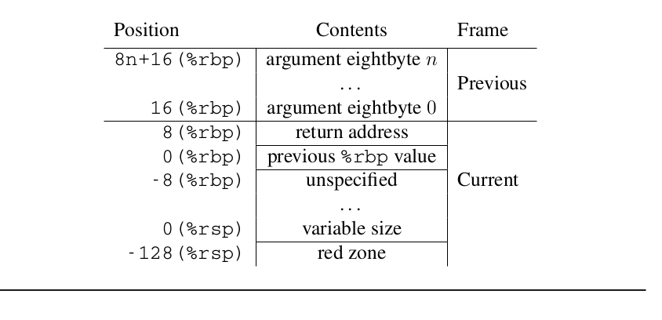
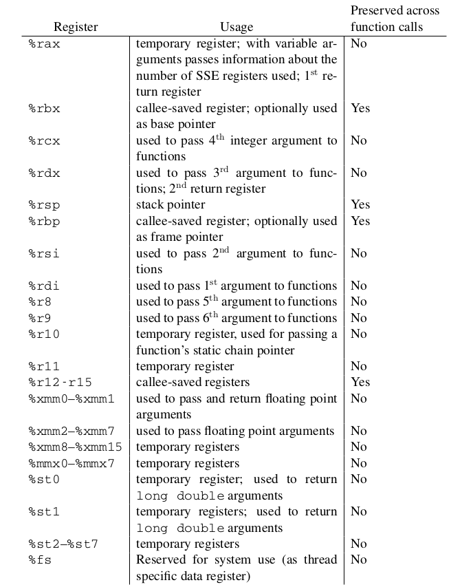
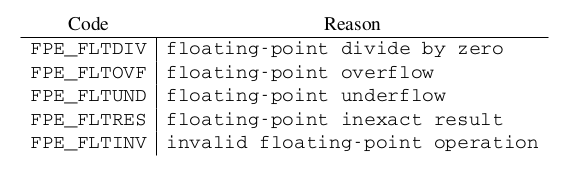
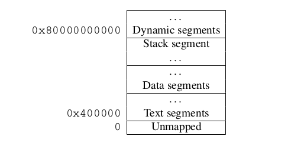
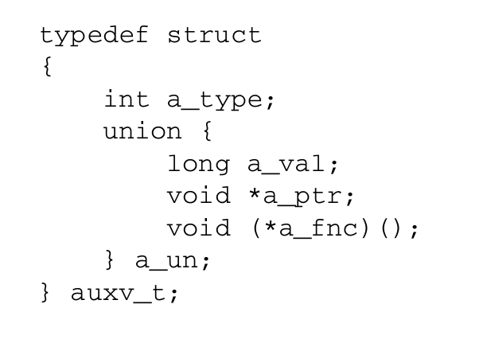
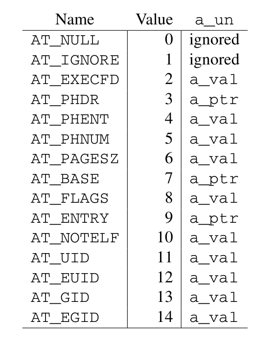
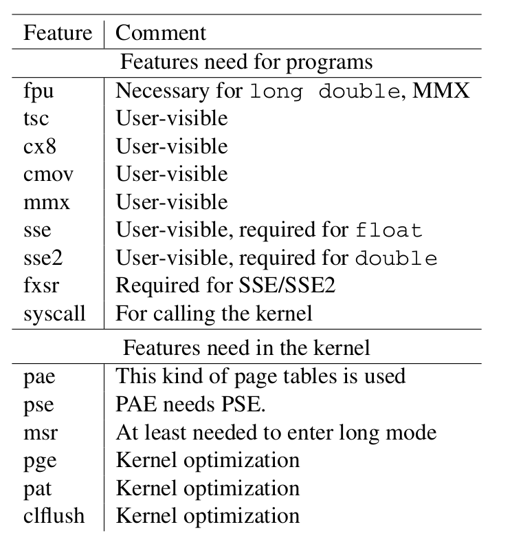

linux 二进制接口
---------------
跟踪信息的实现原理

https://www.kernel.org/doc/html/latest/x86/orc-unwinder.html

linux kernel unwinder选择：

kernel hacking
  --> x86 Debugging
  	-->Choose kernel unwinder:  UNWINDER_ORC:		ORC unwinder
  				    UNWINDER_FRAME_POINTER:	Frame pointer unwinder
  				    UNWINDER_GUESS:		Guess unwinder
  				 
  				    
  	

-------------
 这一段与gcc,elf,ld搅和在一起。
 
 
 

参考：

https://blog.csdn.net/pwl999/article/details/107569603

unwind栈回溯
frame pointers:ebp：保存每层函数调用的堆栈栈顶。
x86_64的frame point模式

.. image:: ./img/fp.png
	:align: center
	:name: 图一

这种方式在堆栈回溯时非常方便快捷。但是这种方法也有自己的不足：

1. 需要一个专门寄存器ebp来保存frame poniter。
2. 保存ebp寄存器即保存回溯信息(unwind info)的动作会被编译成代码，有指令开销。
3. 在回溯堆栈时，除了恢复sp，不知道怎么恢复其他的寄存器。(例如gdb中的 frame n, info reg)
4. 没有源语言信息。

.debug_frame(DWARF):在DWARF6.4 Call Frame Information一节详细的描述了调用栈帧的定义。

调试信息标准DWARF(Debugging With Attributed Record Formats)定义了一个.debug_frame section用来解决上述的难题。

1. 可以把ebp当成常规寄存器使用。
2. 但是当保存esp时，它必须在.debug_frame节中产生一条注释，告知调试器它将其保存在什么位置以及存放在何处。
3. 这种机制还有的好处是它不仅仅是用来恢复ebp，还可以用来恢复其他寄存器。
4. 而且是带外的，不消耗任何指令周期，没有任何性能开销。
这种机制也有其不足：

1. 没有源语言信息。
2. 不支持在程序加载时同时加载调试信息。

 .eh_frame (LSB)
现代Linux操作系统在LSB(Linux Standard Base)标准中定义了一个.eh_frame section来解决上述的难题。这个section和.debug_frame非常类似，但是它解决了上述难题：
1. 拥有源语言信息。
2. 编码紧凑，并随程序一起加载。

但是.debug_frame和.eh_frame同时面临一个难题：怎么样生成堆栈信息表？

CFI directives:
为了解决上述难题，GAS(GCC Assembler)汇编编译器定义了一组伪指令来协助生成调用栈信息CFI(Call Frame Information)。
CFI directives伪指令是一组生成CFI调试信息的高级语言，它的形式类似于：

	f：
		.cfi_startproc
		pushl％ebp
		.cfi_def_cfa_offset 8
		.cfi_offset ebp，-8

关于汇编器利用这些伪指令来生成.debug_frame还是.debug_frame，在.cfi_sections指令中定义。如果只是调试需求可以生成.debug_frame，如果需要在运行时调用需要生成.eh_frame。

2. .debug_frame (DWARF) 详解
^^^^^^^^^^^^^^^^^^^^^^^^^^^^^^

3、Register Rule Instructions
^^^^^^^^^^^^^^^^^^^^^^^^^^^^^^^^^

4、Row State Instructions
^^^^^^^^^^^^^^^^^^^^^^^^^^

5、Padding Instruction
^^^^^^^^^^^^^^^^^^^^^^^^

6、CFI Extensions
^^^^^^^^^^^^^^^^^^^

3. .eh_frame 详解
^^^^^^^^^^^^^^^^^^^^

4. CFI directives 详解
^^^^^^^^^^^^^^^^^^^^^^^

5. kernel unwind 实现
^^^^^^^^^^^^^^^^^^^^^^

6. 用户态常见取栈方法
^^^^^^^^^^^^^^^^^^

---------------
这个规范解决了大部分疑惑。

参照x86_64-abi进行综述性说明

函数调用序列
^^^^^^^^^^^^

标准函数调用顺序，包括堆栈、框架布局、寄存器使用、参数传递等。
标准调用顺序要求仅适用于全局函数。其他编译单元无法访问的本地函数可能使用不同的约定。尽管如此，建议所有函数尽可能使用标准调用序列。

寄存器和栈帧
""""""""""

AMD64 架构提供 16 个通用 64 位寄存器。此外，该架构还提供 16 个 SSE 寄存器，每个 128 位宽和 8 个 x87 浮点寄存器，每个 80 位宽。每个 x87 浮点寄存器都可以在 MMX/3DNow! 中引用！模式作为 64 位寄存器。所有这些寄存器对于正在运行的程序中的所有过程都是全局的。

	
寄存器 %rbp、%rbx 和 %r12 到 %r15 “属于”调用函数，并且被调用函数需要保留它们的值。换句话说，被调用函数必须为其调用者保留这些寄存器的值。剩余的寄存器“属于”被调用的函数。如果调用函数想要在函数调用中保留这样的寄存器值，它必须将值保存在其本地堆栈帧中。

CPU 在进入函数时应处于 x87 模式。因此，每个使用 MMX 寄存器的函数都需要在使用 MMX 寄存器后，在返回或调用另一个函数之前发出 emms 或 femms 指令。%eflags 中的方向标志register 必须在函数入口和函数返回时清除。

栈帧
^^^^^
除了寄存器之外，每个函数在运行时堆栈上都有一个帧。这个堆栈从高地址向下增长。图一 显示了堆栈组织。
输入参数区域的末尾应在 16 字节边界上对齐。换句话说，当控制转移到函数入口点时，值 (%rsp - 8) 始终是 16 的倍数。堆栈指针 %rsp 始终指向最新分配的堆栈帧的结尾。

%rsp 指向的位置之外的 128 字节区域被认为是保留的，不应被信号或中断处理程序修改。因此，函数可以将此区域用于在函数调用中不需要的临时数据。特别是，叶函数可以将这个区域用于它们的整个堆栈帧，而不是在序言和尾声中调整堆栈指针。这个区域被称为红色区域。

参数传递
^^^^^^^

在计算出参数值之后，将它们放入寄存器中，或压入堆栈。以下部分描述了值的传递方式。

定义： 定义了一些类来对参数进行分类。这些类对应于 AMD64 寄存器类，定义为：
	1. 
	
。。。。。。。

操作系统接口
^^^^^^^^^^

异常接口
"""""""

硬件异常类型
***********

虚拟地址空间
""""""""""

页长度
""""""

虚拟地址对齐
"""""""""""

.. image:: ./img/had_e_s.png
	:align: center
	:name: 图三
	
浮点异常

虚拟地址配置

.. image:: ./img/vac.png
	:align: center
	:name: 图五
	

传统段对齐

	
	
处理器初始化
^^^^^^^^^^

初始化栈和寄存器状态
"""""""""""""""""

特定寄存器
*********

栈状态
***********
本节描述 exec (BA_OS) 为新进程创建的机器状态。各种语言实现将这个初始程序状态转换为语言标准要求的状态。

例如，一个 C 程序从一个名为 main 的函数开始执行，声明为：
extern int main ( int argc , char *argv[ ] , char* envp[ ] );

1. arg:
2. argv:
3. envp:

initial process stack:

辅助向量
"""""""
辅助向量是以下结构的数组（参考图 3.10），根据 a_type 成员进行解释。

Auxiliary Vector Types:

1. AT_NULL:
2. AT_IGNORE:
3. AT_EXECFD:
4. AT_PHDR:
5. AT_PHENT:
6. AT_PHNUM:
7. AT_PAGESZ:
8. AT_BASE:
9. AT_FLAGS:
10. AT_ENTRY: a_ptr成员保存有加载器程序进行控制权传递的应用程序的入口点。
11. AT_NOTELE:
12. AT_UID:
13. AT_EUID:
14. AT_GID:
15. AT_EGID:

编码示例
^^^^^^^^

架构约束
"""""""

约定
"""""""
1. name@GOT:指定符号名称从 GOT 的基础到 GOT 条目的偏移量。
2. name@GOTPLT
3. name@GOTOFF:
4. name@GOTPCREL:
5. name@PLT:
6. name@PLTOFF:
7. _GLOBAL_OFFSET_TABLE_:

位置无关的函数序言
"""""""""""""""

数据对象
"""""""""""

函数调用
"""""""""

分支
"""""""""

变量参数列表
""""""""""

DWARF定义
^^^^^^^^^

DWARF 发行值
"""""""""""

DWARF 寄存器号映射
""""""""""""""""

栈展开算法
^^^^^^^^^^

对象文件
————————

ELF头
^^^^^^^

机器信息
"""""""

节
^^^^

节标识
""""""

节类型
""""""

特定节
"""""""""

EH_FRAME节
""""""""""

符号表
^^^^^^^^^^

重定位
^^^^^^^^^^^^

重定位类型
"""""""""

大模式
""""""""

程序加载和动态链接
---------------

程序加载
^^^^^^^^

程序头
"""""""""

动态链接
^^^^^^^^

程序加载器
""""""""""

初始化和结束函数
""""""""""""""

库
----

进一步理解需要参考Intel386 ABI

C库
^^^^^^

全局数据符号
""""""""""

浮点环境函数
"""""""""""

Unwind库接口
^^^^^^^^^^^^
本节定义了 Unwind Library 接口，预计将由任何 AMD64 psABI 兼容系统提供。这是构建 C++ ABI 异常处理工具的接口。我们假设 DWARF 调试信息格式文档中描述的调用帧信息表作为基础。

本节旨在指定一个与语言无关的接口，该接口可用于提供更高级别的异常处理工具，例如 C++ 定义的那些。

展开库接口至少包含以下例程：

	_Unwind_RaiseException ,
	_Unwind_Resume ,
	_Unwind_DeleteException ,
	_Unwind_GetGR ,
	_Unwind_SetGR ,
	_Unwind_GetIP ,
	_Unwind_SetIP ,
	_Unwind_GetRegionStart ,
	_Unwind_GetLanguageSpecificData ,
	_Unwind_ForcedUnwind ,
	_Unwind_GetCFA

此外，定义了两种数据类型（_Unwind_Context 和 _Unwind_Exception）来接口调用运行时（例如 C++ 运行时）和上述例程。所有例程和接口的行为都如同定义了 extern "C"。特别是，名称没有被破坏。作为该接口的一部分定义的所有名称都有一个“_Unwind_”前缀。

最后，编译器会将语言和供应商特定的个性例程存储在需要异常处理的堆栈帧的展开描述符中。 展开程序调用个性例程来处理特定于语言的任务，例如识别处理特定异常的帧。

异常句柄架构
""""""""""

unwinding的原因，两个：
**********************

1. 异常，由支持它们的语言定义
2. “强制”展开（例如由 longjmp 或线程终止引起）

此处描述的界面试图保持两者相似。 但是，有一个主要区别。
1. 在抛出异常的情况下，堆栈会在异常传播时展开，但每个堆栈帧的个性化例程都应该知道是要捕获异常还是要通过异常。因此，此选择委托给 个性例程，无论是“本地”还是“外来”，都可以正常处理任何类型的异常。 下面给出了一些“正确行事”的指导方针。
2. 另一方面，在“强制展开”期间，外部因素正在推动展开。 例如，这可以是 longjmp 例程。 这个外部代理，不是每个个性惯例，知道什么时候停止放松。 _UA_FORCE_UNWIND 标志指示了个性例程没有选择是否继续展开的事实。

为了适应这些差异，提出了两种不同的例程。 _Unwind_RaiseExceptio 在个性例程的控制下执行异常风格的展开。 另一方面，_Unwind_ForcedUnwind 执行展开，但让外部代理有机会拦截对个性例程的调用。 这是使用代理个性例程完成的，该例程拦截对个性例程的调用，让外部代理覆盖堆栈帧的个性例程的默认值。

因此，每个人格例程都没有必要知道任何可能导致放松的外部因素。 例如，C++ 个性例程只需要处理 C++ 异常（并且可能伪装外部异常），但它不需要知道代表 longjmp 或 pthreads 取消完成的任何具体的展开。

unwind过程
***********
标准 ABI 异常处理/展开过程以上述形式之一引发异常开始。 这个调用指定了一个异常对象和一个异常类。
然后运行时框架开始一个两阶段的过程： 

1. 在搜索阶段，框架重复调用个性例程，使用 _UA_SEARCH_PHASE 标志，如下所述，首先针对当前的 %rip 和寄存器状态，然后在每一步将帧展开到新的 %rip，直到个性例程报告 在所有帧中要么成功（在查询的帧中找到处理程序）或失败（没有处理程序）。 它实际上并没有恢复展开状态，个性例程必须通过 API 访问状态。
2. 如果搜索阶段报告失败，例如 因为没有找到处理程序，它将调用 terminate() 而不是开始第 2 阶段。如果搜索阶段报告成功，则框架在清理阶段重新启动。 再次，它使用 _UA_CLEANUP_PHASE 标志重复调用个性例程，如下所述，首先针对当前的 %rip 和寄存器状态，然后在每一步将帧展开到新的 %rip，直到它到达具有标识的帧 处理程序。 此时，它恢复寄存器状态，并将控制权转移到用户着陆板代码。

这两个阶段中的每一个都使用展开库和个性例程，因为给定处理程序的有效性和将控制权转移给它的机制取决于语言，但定位和恢复先前堆栈帧的方法与语言无关。

两阶段异常处理模型对于实现 C++ 语言语义并不是绝对必要的，但它确实提供了一些好处。 例如，第一阶段允许异常处理机制在堆栈展开开始之前消除异常，这允许恢复异常处理（纠正异常条件并在引发异常的位置恢复执行）。而 C++ 不支持恢复异常 处理，其他语言做，两阶段模型允许 C++ 与堆栈上的那些语言共存。

请注意，即使使用两阶段模型，我们也可能针对单个异常多次执行两个阶段中的每一个，就好像该异常被多次抛出一样。 例如，由于无法确定给定的 catch 子句是否会在不执行的情况下重新抛出，因此异常传播有效地在每个 catch 子句处停止，如果需要重新启动，则在阶段 1 重新启动。不需要此过程 对于析构函数（清理代码），因此阶段 1 可以一次安全地处理所有仅析构函数的帧，并在下一个封闭的 catch 子句处停止。

例如，如果展开的前两帧仅包含清理代码，而第三帧包含 C++ catch 子句，则阶段 1 中的个性例程并不表示它为前两帧找到了处理程序。 它必须对第三帧这样做，因为不知道异常将如何从第三帧传播出去，例如 通过重新抛出异常或在 C++ 中抛出一个新异常。

AMD64 psABI 指定的用于实现此框架的 API 在以下部分中描述。

数据结构
"""""""""""

丢出异常
""""""""""""

异常对象管理
""""""""""""""

上下文管理
""""""""""""""

私有例程
""""""""""""""

汇编代码中的展开
^^^^^^^^^^^^^^

开发环境
-------------

约定
------------

GOT指针和IP相对寻址
^^^^^^^^^^^^^^^^^^^

linux 约定
-----------

32位程序执行
^^^^^^^^^^^^^^

AMD64 linux 内核约定
^^^^^^^^^^^^^^^^^^^^

调用约定
""""""""
Linux AMD64 内核在内部使用与用户级应用程序相同的调用约定,喜欢调用系统调用的用户级应用程序应该使用 C 库中的函数。C 库和 Linux 内核之间的接口与用户级应用程序的接口相同，但有以下区别：

1. 用户级应用程序中通过整数寄存器进行参数传递的顺序，%rdi, %rsi, %rdx, %rcx, %r8 和 %r9；内核接口采用如下顺序：%rdi,%rsi, %rdx, %r10, %r8 和 %r9。
2. 系统调用通过syscall指令来实现。内核中会破坏%rcx 和%r11寄存器的内容。
3. 系统调用号通过寄存器%rax进行传递。
4. 系统调用只能传递6个参数，不能通过栈进行直接传递。
5. 从syscall中返回时，寄存器%rax包含系统调用返回值。-4095 ～ -1表示错误。
6. 只能向内核中传递INTEGER或MEMORY类型参数。

栈布局
"""""""
Linux 内核不遵守红色区域

请求处理器特性
""""""""""""

Required Processor Features

其他问题
""""""""

