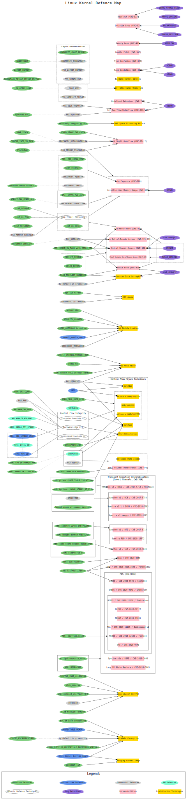

操作系统安全框架
----------------
Linux 内核安全是一个非常复杂的话题。

有许多概念之间存在有趣的关系：

漏洞类别
开发技术
错误检测机制
防御技术
Linux内核主线提供了一些防御技术。其他的出于各种原因（例如，其中一些是商业性的）正在脱离树。此外，还有一些依赖于特殊硬件特性的内核防御。

拥有 Linux 内核安全性的图形表示会很方便。这就是为什么我创建了一个Linux 内核防御图来显示所有这些概念之间的关系。

节点连接并不意味着“完全缓解”。相反，每个连接都代表某种关系。所以 Linux Kernel Defense Map 应该有助于浏览文档和 Linux 内核源。它还提供漏洞类别的通用弱点枚举 (CWE) 编号。

该映射描述了内核安全加固。它不包括切割攻击面、用户空间安全特性和各种 Linux 安全模块 (LSM) 强制执行的策略。

安全功能

- [Grsecurity features](https://grsecurity.net/features.php)

- [The State of Kernel Self Protection](https://outflux.net/slides/2021/lss/kspp.pdf) by Kees Cook

- Linux kernel [security documentation](https://www.kernel.org/doc/html/latest/security/self-protection.html)

- Linux kernel [mitigation checklist](https://github.com/hardenedlinux/grsecurity-101-tutorials/blob/master/kernel_mitigation.md) by Shawn C

- [Trends, challenge, and shifts in software vulnerability mitigation](https://github.com/Microsoft/MSRC-Security-Research/tree/master/presentations/2019_02_BlueHatIL) by MSRC

- [Pursuing Durable Safety for Systems Software](https://www.sstic.org/2020/presentation/ouverture_2020/) by Matt Miller

- [A Decade of Linux Kernel Vulnerabilities, their Mitigation and Open Problems](https://github.com/maxking/linux-vulnerabilities-10-years) by Abhilash Raj

- [Spectre & Meltdown Checker](https://github.com/speed47/spectre-meltdown-checker) by Stéphane Lesimple

kconfig-hardened-check
^^^^^^^^^^^^^^^^^^^^^^^
帮助我根据我的安全强化首选项检查 Linux 内核 Kconfig 选项列表，这些首选项基于
https://github.com/a13xp0p0v/kconfig-hardened-check

grsecurity
^^^^^^^^^^^^^
https://grsecurity.net/features

内核安全：
- 访问控制（如SELinux);
- attack surface reduction(e.g. seccomp)
- bug fixing(eg.g. CVEs);
- 用户空间保护
- 内存完整性；

风险不是理论上的。 攻击者正在观察提交，他们比我们更善于发现错误：

bug
^^^^^^^^^^
查找bug
"""""""""
- 静态检查：gcc,Clang,Coccinelle,smatch,sparse,Coverity
- 动态检查：kernel,KASan-family,syzkaller,stress-ng,trinity
确定bug
"""""""""

KSPP
""""""
Kernel Self-Protection Project

定位bug举例
""""""""""
 building with -Wimplicit-fallthrough by default for GCC! (last 69 marked
and 7 missing breaks found)
● 2 refcount_t conversions (1 bug found via refcount_t)
● pidfd from pidfd_open()
● CR4, CR0 pinning on x86
● heap variable auto initialization via init_on_{alloc,free}=1 boot parameter
● additional kfree() sanity checking
● KASLR enabled by default on arm64
● hardware security embargo documentation

https://outflux.net/slides/2021/lss/kspp.pdf

针对gcc各种选项的实际应用问题非常关键。
注意我们要保持对内核的专注。

只专注内核。
Various soon and not-so-soon features
● more hardware memory tagging
● x86 CET/IBT
● x86 SMAP emulation
● execve() brute force detection
● write-rarely memory
● arm32 feature parity
● eXclusive Page Frame Owner
● arithmetic overflow detection
● memcpy() bounds checks
● Function Granular KASLR
● eXecute Only Memory
● read-only page tables
● type-aware slab allocator
● hypervisor magic :)

注意：

KSPP：这和自我保护项目：重点关注项目。
--------------------------------

self-protection:内核安全文档：重点部分
------------------------------------
https://www.kernel.org/doc/html/latest/security/self-protection.html

清单：
--------
https://github.com/hardenedlinux/grsecurity-101-tutorials/blob/master/kernel_mitigation.md

MSRC
-------

追求系统软件的持久安全性 作者：Matt Miller
-------------------------------------

linux 内核漏洞、措施及当前问题总结
-------------------------------

我们从其中看出针对linux安全的问题。

图：

// Linux Kernel Defense Map 显示以下之间的关系：
//   - 漏洞类
//   - 开发技术
//   - 错误检测机制
//   - 防御技术

绿色标记：Linux内核的主线防御
白色标记：通用防御技术
深蓝色标记：主线不支持的防御
紫色标记：bug检测
灰色标记：商用防御
粉色标记：漏洞
浅蓝色标记：硬件防御
黄色标记：利用技术

Linux内核的主线防御
^^^^^^^^^^^^^^^^^^^
RANDOMIZE_{BASE,MEMORY}:

RANDSTRUCT:
LATENT_ENTROPY:
RANDOMIZE_KSTACK_OFFSET_DEFAULT:
__ro_after_init:
REFCOUNT_FULL:
Read-only swapper_pg_dir:
SCHED_STACK_END_CHECK:

VMAP_STACK:
THREAD_INFO_IN_TASK:
STACKLEAK:

X86: X86_INTEL_UMIP
kptr_restrict:

SCURITY_DMESG_RESTRICT:
INIT_STACK_ALL_ZERO:
STRUCTLEAK_BYREF_ALL:

slub_debug=P

init_on_free

PAGE_POISONING

init_on_alloc

HARDENED_USERCOPY:

重点参考:     https://www.anquanke.com/post/id/238363

分析：
- Layout Randomization:
- 

引用
---------
https://github.com/bsauce/kernel-security-learning
https://www.jianshu.com/p/4bc65d4477d3

---------------------------

